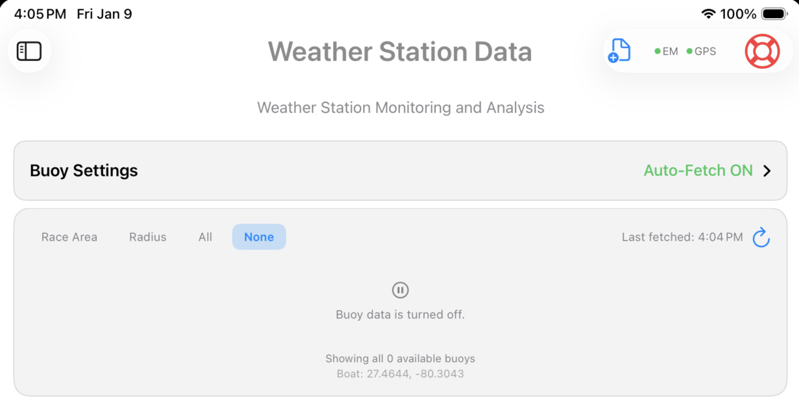
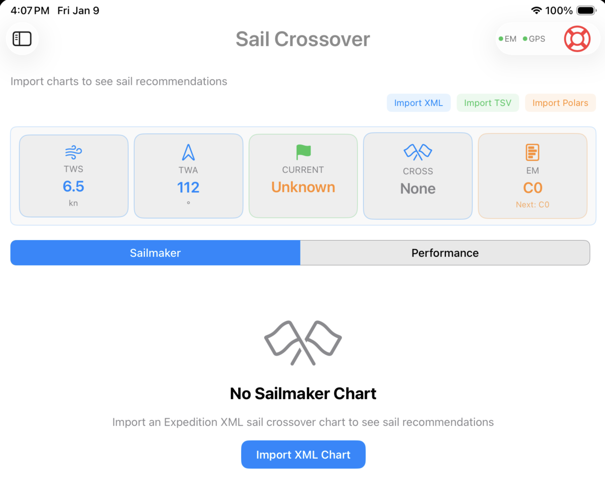

# SailWatchPro

  

  <strong>CRP Test Guide</strong>

---

## Table of Contents

- [Getting Started](#getting-started)
- [First Launch Setup](#first-launch-setup)
- [Expedition Marine Requirements](#expedition-marine-requirements)
- [Connection Settings](#connection-settings)
- [Boat Configuration](#boat-configuration)
- [Display Options](#display-options)
- [Safety Settings](#safety-settings)
- [Performance Issues](#performance-issues)
- [Support & Updates](#support--updates)

---

## Getting Started

**Latest Version**  
Remove the app from your iOS device and install the latest version.

### First Launch
The first launch will take a few additional moments while the app installs the ECMWF libraries once.

### Test Areas
- Pre-start buttons
- Weather Data
- Competitors
- Buoy Fetch - Test automated 

## Buoy List Import
### Download buoys list

### Import buoys list
The file name must remain default_buoys.csv.  To add more buoys, follow the format used in the default file.  When you import a buoy file, the new file replaces the existing list.

  
   <em>Load your race buoy weather stations</em>

 

---

## Import Sail Crossover Charts and Polars
### Download Source Datafiles

### Import the Source Datafiles using the import buttons

  
   <em>Enter your Sail Crossover Charts and Polars</em>

 

---

Visit the full release page:  
[All Import Files Release →](https://github.com/jbistis/SailWatchPro-Public/releases/tag/ImportFiles)

## Display Options
- Light Mode and Dark Mode are set using your iOS device Settings > Display & Brightness > APPEARANCE
- Night Mode (red-tinted) is enabled and disabled in Settings
- Map Style (hybrid, standard, satellite, imagery)  

## Safety Settings
- **Depth Alerts** — Draft + safety margin warnings  
- **Audio Countdown** — Spoken start sequence  
- **MOB (Man Overboard)** — Emergency position mark & tracking

---

## Test Scripts

### Pre-Start Controls
- Start clock with 15-minute timer and test +1, -1, Sync, and Kill buttons
- Start clock with 10, 5, and 3-minute timers.
- Set the PORT and Starboard start line pins.
- Select a course.

- ### Weather Data
- Import the buoys
- Check that Auto-Fetch is functioning properly by letting it sit long enough to execute a few auto-fetches.
- Check that buoys that do not report history accure history as auto-fetch proceeds
- Check that the GRIB data is plotted along with the buoy's actual data

Happy sailing! ⛵
**SailWatchPro Team**

