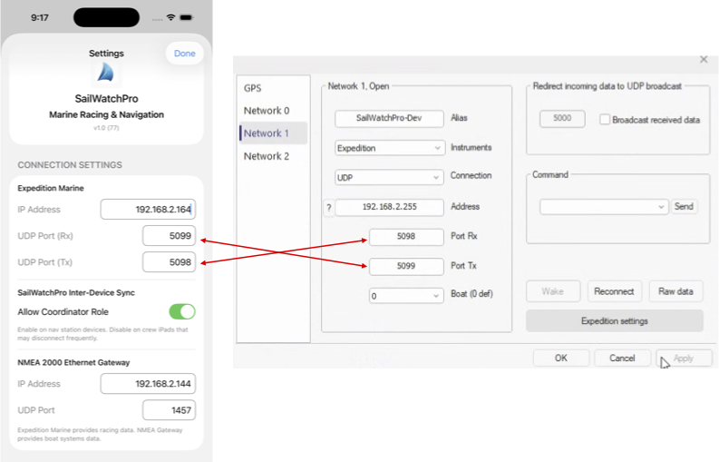

# SailWatchPro

  

  <strong>CRP Test Guide</strong>

---

## Getting Started

**Latest Version**  
Remove the app from your iOS device and install the latest version.

### First Launch
The first launch will take a few additional moments while the app installs the ECMWF libraries once.

### Settings
- Download the App
- Start the App on your iPhone or iPad
- iPad - navigate to Settings
- iPhone - navigate to More > Settings

**Connection Information**
Enter values specific to your boat as supplied by your Expedition Marine Administrator

  
   <em>Enter your connection parameters</em>

 

**Boat Details**
Enter values specific to your boat for:
- Boat Name: Della Aurora
- MMSI: 338480651

---

## Test Scripts

### Pre-Start Controls
- Start clock with 15-minute timer and test +1, -1, Sync, and Kill buttons
- Start clock with 10, 5, and 3-minute timers.
- Set the PORT and Starboard start line pins.
- Select a course.

### Import Performance Files
- Import Polars

- Import Crossover Chart

- Import Performance Crossover Chart

### Weather Data
- Import Buoys

- Import a current and relevant GRIB file
- Check that Buoy Auto-Fetch is functioning properly by letting it sit long enough to execute a few auto-fetches.
- Check that buoys that do not report history accure history as auto-fetch proceeds
- Check that the GRIB data is plotted along with the buoy's actual data

### Competitors 
- Import Competitors

- Check ORC poll

### Display Options
- Test switching between Light Mode and Dark Mode is set using your iOS device Settings > Display & Brightness > APPEARANCE
- Night Mode (red-tinted) is enabled and disabled in Settings, and check for hot spots.

Visit the full release page:  
[All Import Files Release →](https://github.com/jbistis/SailWatchPro-Public/releases/tag/importFilesBuild65)

Happy sailing! ⛵
**SailWatchPro Team**

