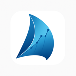
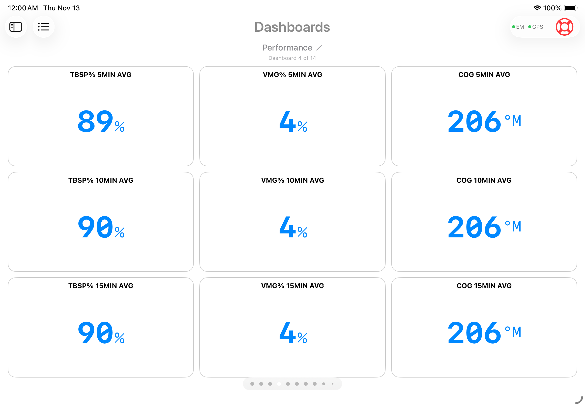
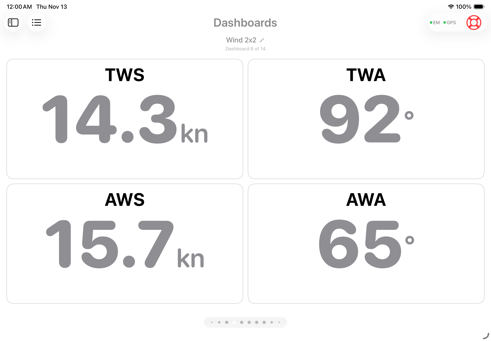
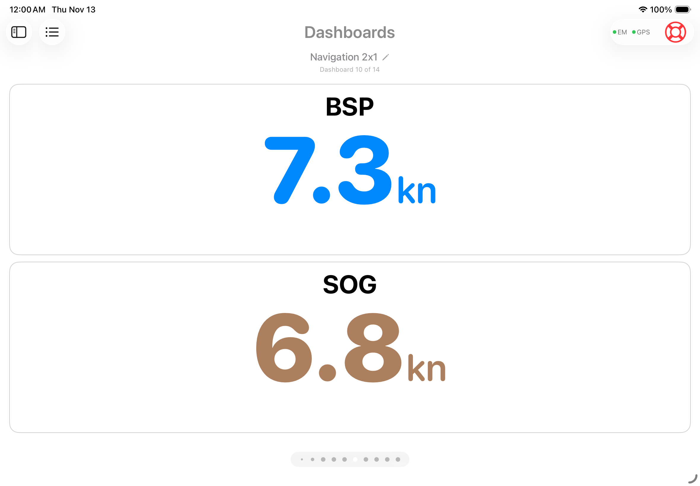
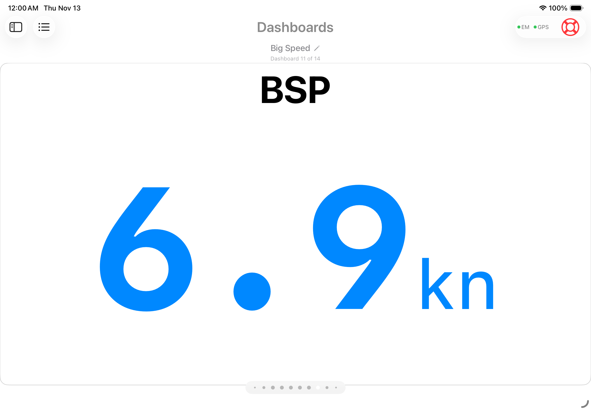
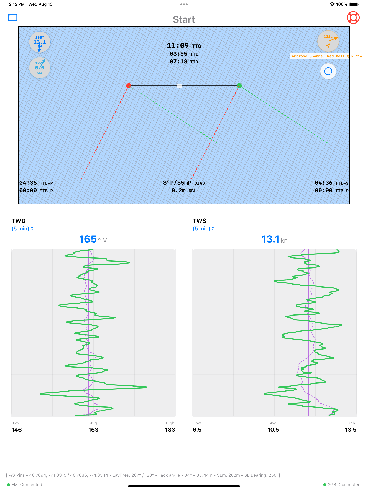
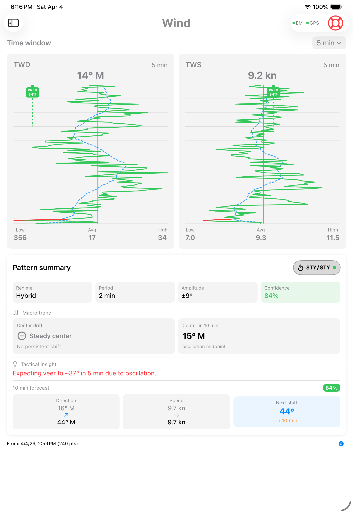
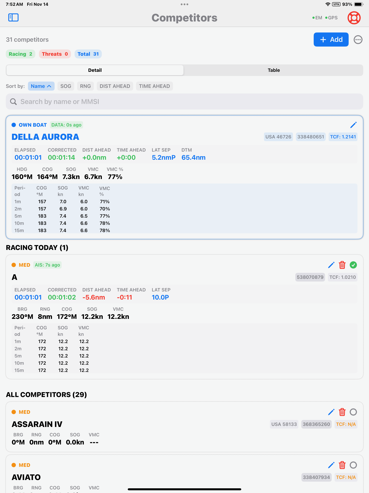
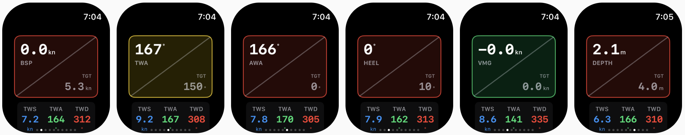

# SailWatchPro

  

 <strong>Win More Races. Make Faster Decisions.</strong>

  

# **What it does**
SailWatchPro extends and enhances Expedition Marine's capabilities, bringing them above deck with a sleek, touch-friendly interface for iPad, iPad Mini, iPhone, and Apple Watch. Built for competitive sailing, SailWatchPro delivers real-time tactical insights by synthesizing critical data—such as weather patterns, boat speed metrics, and course positioning—into clear, coherent actionable information and advisories. Whether you're racing around the buoys or navigating offshore, SailWatchPro empowers your team to make fast, confident decisions when every second counts.

# **Application Pillars**
The software is divided into 4 pillars:
<ul>
  <li>Racing Management</li>
  <li>Weather Observations and Analytics</li>
  <li>Competitor Tracking and Threat Assessment</li>
  <li>Strategic and Tactical Advisories</li>
</ul>

<!-- Section - Racing Management -->
## Racing Management

### Prestart
<strong>Master the Pre-Start with SailWatchPro's Mobile Edge</strong> 
Staying organized and dialed in during the pre-start phase is critical for nailing a perfect start. Expedition delivers world-class pre-start tools—line pings, timers, bias calculations, and more—but it often relies on a single user often below deck having to mouse click through to a Windows interface.

<strong>SailWatchPro upgrades that workflow for the modern boat</strong> 
It replaces Expedition's clicks with intuitive iOS touch controls on iPad, iPhone, or even Apple Watch. Above-decks crew can now divide roles seamlessly: ping the line ends, manage the countdown timer, select and lock the course—all with quick taps, no heads-down fumbling.
Once the timer and course are set (still powered by Expedition's precision below), SailWatchPro delivers a clean, visual starting dashboard tailored for the tactician. Get instant guidance on approach decisions, including start advice factoring in current wind, local current effects, line bias, and bearing to the first mark. 

<strong>Go from chaos to control</strong> 
Let the deck team own the start—confidently.

<!-- 

  

 -->
 
### Start Line
The starting box 

### Navigator View and Racing Dashboards

<strong>Stay Ahead of the Drift</strong> 
Once clear of the start line, the real challenge begins: sailing your most optimal course and trim while monitoring critical metrics in real time. Too often, the sharpest insights arrive only after the race—when it’s too late to act. The French call this l’esprit de l’escalier (“staircase wit”): the feeling of recovering your sharp thoughts only once you’re no longer in the situation to use them.

Mast displays do an excellent job showing live NMEA and Expedition data—boat speeds, headings, polar performance percentages, and more. For strong teams, most metrics stay optimized most of the time. But the race is won or lost in the few that drift off target over minutes, not seconds—subtle changes that even the most cluttered deck displays can miss.

Worse, some critical conditions only reveal themselves when combining multiple data points or viewing trends over time: the relationship between mark bearing and opposite-tack layline, or a persistent current push that’s slowly knocking COG/VMG.

<strong>SailWatchPro’s averaging engine changes that</strong>
It automatically computes rolling 5-, 10-, and 15-minute averages for key Expedition-fed metrics where longer context drives better decisions. In offshore or long-leg racing, instant VMG% or COG on the mast is useful—but seeing your 5/10/15-minute trends tells the driver (and tactician) if they’re truly holding the objective, catching a slow leeway drift, or needing a mode adjustment before it costs you the leg.
No more hindsight regrets.  Get the long view in real time—so you can correct course before the fleet does.
Our Navigator View and Racing Dashboards provide this essential information to help us fly the right sail, not overstand a layline, or stay on the optimal course, just to name a few.

### Racing Dashboards
The racing dashboards are designed to assit in making smarter decisions.  

<!-- Section - Weather Observations and Analytics -->
## Weather Observation and Analytics
<strong>Unlock the Real Race Weather Edge with SailWatchPro</strong> 
Weather forecasts start degrading the moment they're published. Savvy navigators know that understanding spatial and temporal inaccuracies is often the difference between leading the fleet and chasing it.
In their limited spare time (when not sleeping), most navigators juggle GRIB viewers, surf buoy data on their phone, and scribble notes about shifting winds—trying to build a big-picture view of what's really happening across the race area. Boat instruments are great, but your boat is essentially just one moving buoy—it can't show you the larger view.
  
<strong>SailWatchPro changes the game</strong> 
Once you select your race course, the software automatically defines the race area and identifies the most relevant weather observation stations. With a simple set-it-and-forget-it setup, it periodically fetches the latest buoy data at your chosen interval—no more manual hunting.  Import your GRIB files, and SailWatchPro overlays predicted vs. actual weather for every key station, tracking how reality is diverging from the forecast in real time. See exactly where, when, and how the wind, pressure, or other elements are shifting differently than expected—across the entire race area.
Stop guessing. Start knowing.  Gain the advantage the fleet can't see coming.

## Competitor Tracking and Threat Assessment
<strong>Know the Real Score Mid-Race with SailWatchPro's Fleet Intelligence</strong> 
After the start gun, the real race begins: Where are your competitors, and how are you actually performing against them on handicap?
Competitor boat performance often reveals the fastest path—which side of the course to favor, which areas to avoid. Basic AIS gives you range, bearing, SOG, and COG for each boat… but SailWatchPro goes much further.
  
For both handicaped racing, the software calculates live corrected time for every competitor against yours as the race unfolds. 

<strong>See instantly:</strong>
<ul>
  <li>If you're beating a boat that's physically ahead (gaining on corrected time)</li>
  <li>Or losing to one that's behind (they're pulling away despite position)</li>
</ul>

<strong>It also tracks lateral separation across the fleet—so you can visualize who's leveraged to windward/leeward and decide:</strong>
<ul>
  <li>Time to take a risk and lever hard for a comeback?</li>
  <li>Or play it safe, cover the fleet, and cross the line to the podium?</li>
</ul>

With the automated ORC interface, simply select the scoring method once the Race Committee announces it—SailWatchPro downloads all registered boats' TCFs automatically. No more tedious manual entry.
Enter your competitors' boat details once to a csv file, then just click who you're racing against for any given race. It's effortless fleet awareness that lets you sail smarter, react faster, and win more.
Stop guessing your position on handicap.  Start knowing—and acting on it—in real time.

## Strategic and Tactical Advisories
<strong>Cut Through the Data Noise with SailWatchPro's Advisory Workbench</strong> 
With modern racing sailboats, information overload is almost inevitable. Sensors and systems pump out data multiple times per second—polars, targets, laylines, currents, leeway, wind shifts—and it's all too easy to get lost in the trees and lose sight of the forest.  The SailWatchPro Advisory Workbench delivers a customizable, centralized dashboard of high-value insights automatically extracted from your live data streams—so you can focus on steering, trimming, and tactics instead of mental math.

<strong>A few examples of always-on advisories:</strong> 
Continuously compares Speed Through Water (STW) to Speed Over Ground (SOG) and alerts you when you're pushing too much current (or getting a free ride).
Tracks your desired heading to the next mark against actual Course Over Ground (COG), warning you the moment you're being gradually knocked off your line by leeway or current.

These are just two of many preconfigured, extensible advisories—tailor them to your boat, your crew, and your race strategy.
Sure, you can get this information by staring at mast displays, scribbling notes, and doing constant mental calculations…
But why burn brainpower when SailWatchPro can watch it for you, 24/7, and only interrupt when it matters?
Stay ahead of the fleet. Stay focused on the race.

## Key Features

 
 
 
 

### 📊 **Customizable Dashboards**
12 different layouts that display any Expedition Marine channel. Configure them for different race scenarios—pre-start, upwind work, reaching, or offshore. Fields show context-aware data based on sailing mode and provide visual alerts for out-of-range conditions.

### 🎯 **Start Line Tools**

 

Ping start line pins with a double-tap. The app calculates line bias, distance below line, and displays laylines with timing data for port, center, and starboard positions. Set countdown timers and sync them to the race sequence.

### 🌬️ **Wind Analysis**

 

Real-time wind trend analysis using rolling averages, FFT, and wavelet transforms. The app identifies patterns like veering, backing, building, or oscillating conditions and displays them with confidence indicators. Maintains a 6-hour wind history that automatically syncs across all crew devices on your boat's network.

### 🗺️ **Competitor Tracking**

  
  

Track competitor positions with calculated metrics including distance ahead/behind, corrected time deltas, and lateral separation. Import competitor data from YachtScoring or CSV files, with automatic ORC rating retrieval. The system identifies threats based on proximity and tactical position.

### 🗺️ **Navigation & Course Management**

  

Electronic charts display your position, race course overlay, and nearby buoy wind data. Mark waypoints with TWA information to plan routing based on forecasted conditions along your course.

### ⌚ **Apple Watch Integration**

 

Dedicated watch views for race timer, speed, heel angle, VMG, wind angles, and depth. Data syncs from your iPhone and the watch automatically switches to depth monitoring when approaching shallow water.

---

## Additional Capabilities

**Sail Management** – Import designer or performance-based crossover charts. Track sail inventory and log sail change events with time and location data for upload to Sailnjord.

**Weather Data** – Retrieve wind and weather information from NOAA, NDBC, NERACOOS, and LISICOS buoys within 100nm. Data syncs across all devices on your boat's network.

**Barometric Monitoring** – Track atmospheric pressure trends with visual history. The app alerts when pressure data stops updating.

**MOB Function** – Triggers alerts to Expedition and chartplotters, calculates estimated drift position, and provides hypothermia risk assessment.

---

## Technical Overview

SailWatchPro is designed for competitive sailing with features that address common racing scenarios:

- **12 Customizable Dashboards** with any Expedition Marine channel
- **Wind Trend Analysis** using FFT and wavelet transforms
- **Competitor Tracking** with distance and corrected time calculations
- **Start Line Analysis** with pin pinging and bias computation
- **Performance Metrics** with 5/10/15-minute rolling averages
- **Apple Watch Support** with automatic mode switching
- **Display Modes** including night mode with red-tinted display
- **Two-Way Expedition Integration** for marks, courses, and waypoints

---

## Requirements

- iOS 18.5+ (iPad/iPhone) | watchOS 11.5+ (Apple Watch)
- Expedition Marine 12.4.12+
- Reliable boat WiFi network

---

## Getting Started

1. **Connect** – Configure your Expedition Marine network settings
2. **Setup** – Enter boat parameters (length, draft, MMSI)
3. **Customize** – Select dashboard layouts for your racing style
4. **Use** – Access real-time data during races

[Full setup guide available here](https://docs.google.com/document/d/1cXRDmIqwttnDQbBGQB0azVdZFzVpno5fVTCnSREfSbo/edit?usp=sharing)

---

## Feedback & Support

SailWatchPro is actively developed based on user feedback from competitive sailing environments.

**[Report Issues & Request Features →](https://github.com/jbistis/SailWatchPro-Public/issues)**

---

*May you always find the favorable shift.*

**– The SailWatchPro Team**
