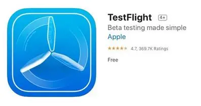

# SailWatchPro

  
    
  <strong>Win More Races. Make Faster Decisions.</strong>

  <strong>Jump to Beta Invite → <a href="#beta-request">Click here</a></strong>

<!-- 

  
   <em>SailWatchPro Start Line Dashboard</em>

 -->
<!-- 

  

 -->

SailWatchPro extends Expedition Marine above-deck with a modern, touch-first iOS interface for iPad, iPhone, Mac, and Apple Watch. It synthesizes real-time data into clear, actionable insights and advisories — helping you make faster, more confident decisions on the water.

## Key Pillars
- **Data Management** — Full access to all Expedition Marine channels, plus many computed channels derived from Expedition data and other NMEA sources — including a Boat Performance Database, Wind Database, and powerful 5/10/15-minute Averaging Engine for any channel.
- **Racing Management** — Pre-start, start line, course marks, course map, and customizable dashboards
- **Weather Observations & Analytics** — Boat Instruments + Buoys + GRIB fusion, trend analysis
- **Competitor Tracking** — Live Leaderboard and map with corrected time and distance & fleet awareness, ORC Interface
- **Strategic & Tactical Advisories** — Automated high-value alerts

### Racing Management
**Pre-Start & Start Line**  
Expedition provides precision timing, line pings, and bias. SailWatchPro makes it mobile and intuitive — above-deck touch controls for pinging, timer, course selection, and visual dashboards for approach decisions.

  
   <em>Pre-Start Dashboard</em>

 

  
   <em>Start Line Visuals & Bias</em>

 

  
   <em>Course Table View with Marks Bears, and Estimated Wind Angles</em>

 

  
   <em>Course Mao with Buoy/GRIB data and Compeitor Heat Map</em>

 

### Weather Observations & Analytics
Automatic polling of nearby buoys (NOAA, NDBC, etc.) within a user-defined distance beyond the race area. Overlay predicted GRIB with actual observations and track divergences in real time.

  
   <em>Automated recurring buoy data fetching</em>

 

**Weather Station Wind Analysis**  
Visually compare buoy observations with GRIB forecasts and trends for every key station — see exactly how reality is diverging across the race area.

   <!-- Use your Virginia Key screenshot here -->
   <em>Buoy: Predicted vs. Actual Wind Trends</em>

 

**Boat Instrumentation Wind Analysis**  
Your boat is a moving weather station. SailWatchPro analyzes real-time wind trends using rolling averages, FFT, and wavelet transforms to identify veering/backing, building, and oscillating patterns — with confidence indicators and a 6-hour wind history that syncs across devices.

  
   <em>Boat: Wind Trends from instruments</em>

 

  
   <em>Boat: Predicted vs. Actual Wind Trends</em>

 

### Competitor Tracking
Live corrected time vs. handicap, lateral separation visualization — know instantly if you're gaining or losing on corrected time, even when boats are physically ahead or behind.

   <!-- Use your Virginia Key screenshot here -->
   <em>Competitor Tracking with live leaderboard</em>

 

### Strategic & Tactical Advisories
Centralized, customizable alerts that monitor for you: current push, leeway drift, sail mismatches, barometric trends, and more — so you can focus on steering and tactics.

   <!-- Use your Virginia Key screenshot here -->
   <em>Advisories in realtime/em>

 
    
**Dashboards**  
12 customizable layouts (any Expedition channel + computed metrics like 5/10/15-min averages). Context-aware alerts help maintain trim, avoid overstanding, and correct drift.

  <strong>Select any channel, including computed channels derived from Expedition Marine Channels</strong> 

  

 

  <strong>Prestart Dashboard Example</strong> 

  

 

  <strong>Buoy Racing Dashboard Example</strong> 

  

 

  <strong>Offshore Racing Dashboard Example</strong> 

  

 

  <strong>Driver Performance Dashboard Example</strong> 

  

 

  <strong>Four Channels</strong> 

 

 

  <strong>Build your own custom names in custom order</strong> 

 

 

## Apple Watch Integration
Dedicated views for timer, speed, heel, VMG, wind, and depth — auto-switches to shallow-water monitoring.

  

 

## Technical Highlights
- GRIB parsing via ECMWF ecCodes bridge
- 5/10/15-min averaging engine
- Two-way Expedition integration
- Night mode with red tint

## Requirements
- iOS 18.5+ (iPad/iPhone) / macOS 15.6+ (arm) / watchOS 11.5+
- Expedition Marine 12.5.11+ (latest encouraged)
- Reliable boat WiFi
- NMEA 2000 Ethernet Gateway for competitor tracking via AIS

## Getting Started
1. Connect to the Expedition network  
2. Enter boat parameters  
3. Customize dashboards  
4. Race with real-time edge  

[Full setup guide →](https://docs.google.com/document/d/1cXRDmIqwttnDQbBGQB0azVdZFzVpno5fVTCnSREfSbo/edit?usp=sharing)

[Full user guide →](https://docs.google.com/document/d/1cXRDmIqwttnDQbBGQB0azVdZFzVpno5fVTCnSREfSbo/edit?usp=sharing)

## Pricing & Availability
Currently in limited beta.  
Full release and pricing details coming soon — contact us for early access.

  <strong>Limited Invite-Only Beta</strong> 
  SailWatchPro is currently in closed beta with a small group of competitive boats. 
  Full release coming soon — we're adding testers selectively.

  <strong>Request Beta Invite</strong> 
  Email me directly: <a href="mailto:james.bistis@icloud.com?subject=SailWatchPro%20Beta%20Invite%20Request">james.bistis@icloud.com</a> 
  <small>Please include your boat type, racing plans, and Expedition version.</small>

[Report Issues & Suggestions →](https://github.com/jbistis/SailWatchPro-Public/issues)

*May you always find the favorable shift.*  
**– The SailWatchPro Team**

<!-- End of Version

