# SailWatchPro

  
    
  <strong>Win More Races. Make Faster Decisions.</strong>

  

SailWatchPro brings Expedition Marine's world-class capabilities above deck with a modern, touch-first iOS interface for iPad, iPhone, and Apple Watch. Built for competitive sailors, it synthesizes real-time data — wind trends, performance metrics, course positioning, and more — into clear, actionable insights and advisories.

## Key Pillars
- **Racing Management** — Pre-start control, start line visuals, and customizable dashboards
- **Weather Observations & Analytics** — Buoy data fusion, GRIB predicted vs. actual comparisons
- **Competitor Tracking** — Live corrected time, separation, and fleet awareness
- **Strategic & Tactical Advisories** — Automated high-value alerts from live data streams

### Racing Management
**Pre-Start & Start Line**  
Expedition delivers precision timing, line pings, and bias calculations. SailWatchPro makes it mobile and intuitive — above-deck touch controls for pinging, timer management, course selection, and a clean visual dashboard for approach decisions.

  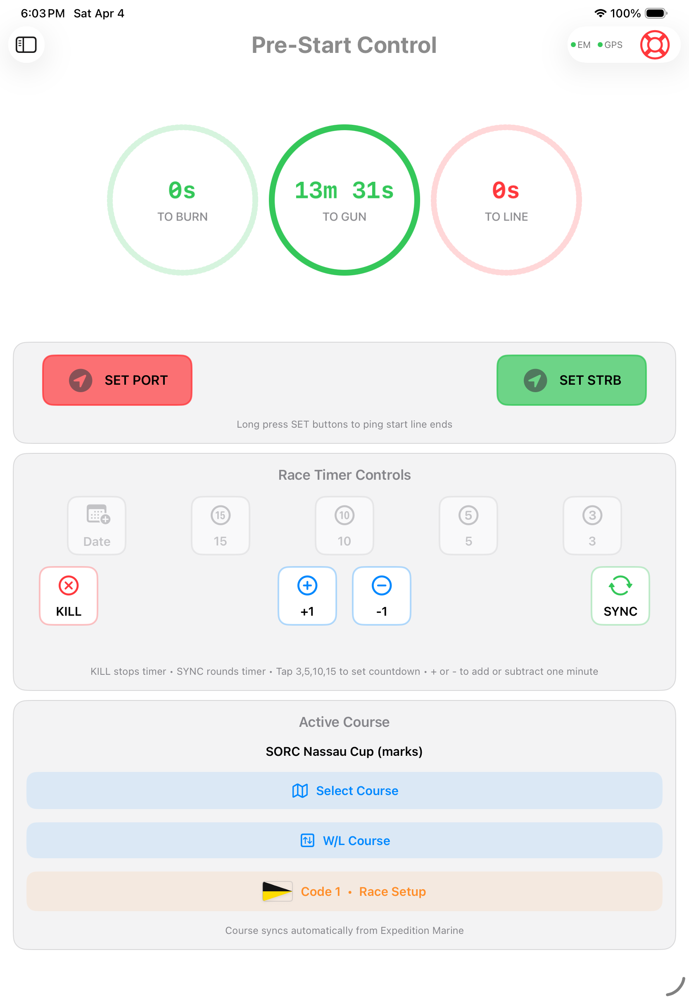
   <em>Pre-Start Dashboard – Mobile Edge for Above-Deck Control</em>

  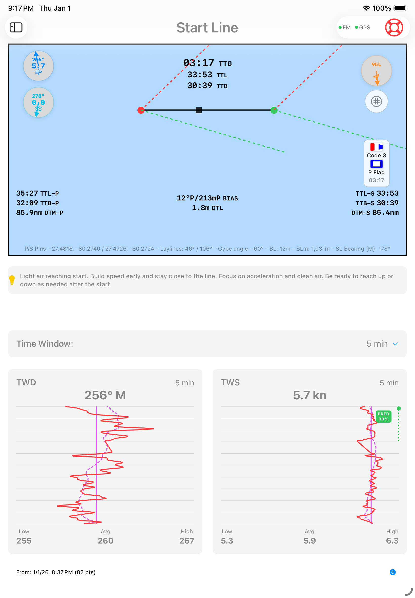
   <em>Start Line Visuals & Bias</em>

**Navigator View & Dashboards**  
12 customizable layouts (any Expedition channel + computed metrics like 5/10/15-min averages). Context-aware alerts help maintain optimal trim, avoid overstanding laylines, and correct drift before it costs places.

### Weather Observations & Analytics
Automatic polling of nearby buoys (NOAA, NDBC, etc.) within 100nm. Overlay predicted GRIB vs. actual observations, track divergences in real time, and analyze trends with rolling averages and advanced transforms (FFT, wavelet) for confident race-area decisions.

### Competitor Tracking
Live corrected time vs. handicap, lateral separation visualization, and performance insights — know instantly if you're gaining or losing on corrected time, even when boats are physically ahead/behind.

### Strategic & Tactical Advisories
Centralized, customizable alerts that watch for you: current push, leeway drift, sail mismatches, barometric trends, and more. Focus on steering and tactics instead of mental math.

<!-- Add 3–4 more key screenshots here -->

## Apple Watch Integration
Dedicated views for timer, speed, heel, VMG, wind, and depth — auto-switches to shallow-water monitoring.

## Technical Highlights
- GRIB parsing via ECMWF ecCodes bridge
- 5/10/15-min averaging engine
- Two-way Expedition integration
- Night mode with red tint
- iOS 18.5+ / watchOS 11.5+ / Expedition Marine 12.5.11+

## Requirements
- iOS 18.5+ (iPad/iPhone) | watchOS 11.5+  
- Expedition Marine 12.5.11+ (latest encouraged)  
- Reliable boat WiFi

## Getting Started
1. Connect to the Expedition network  
2. Enter boat parameters  
3. Customize dashboards  
4. Race with real-time edge  

[Full setup guide →](https://docs.google.com/document/d/1cXRDmIqwttnDQbBGQB0azVdZFzVpno5fVTCnSREfSbo/edit?usp=sharing)

## Pricing & Availability
Currently in limited beta with a small group of boats.  
Full release and pricing details coming soon — contact us for early access.

**Request Beta Access** → [james.bistis@icloud.com](mailto:james.bistis@icloud.com?subject=SailWatchPro%20Beta%20Access%20Request)  
or email directly: james.bistis@icloud.com

[Report Issues & Suggestions →](https://github.com/jbistis/SailWatchPro-Public/issues)

*May you always find the favorable shift.*  
**– The SailWatchPro Team**

<!-- End of GROKs version

 
### Start Line
The starting box is a rather hectic time and place when in sequence.  Expedition Marine excels at calculating the numbers you need to nail the start, including all the times and distances to line, to burn, and to gun, to name just a few.  SailWatchPro presents a startbox in the iOS interface that includes start advice, a visual representation of the start line bias, and the RC boat flags you should see for your current place in the sequence, to help ensure you have it right.  

 

### Navigator View and Racing Dashboards

<strong>Stay Ahead of the Drift</strong> 
Once clear of the start line, the real challenge begins: sailing your most optimal course and trim while monitoring critical metrics in real time. Too often, the sharpest insights arrive only after the race—when it’s too late to act. The French call this l’esprit de l’escalier (“staircase wit”): the feeling of recovering your sharp thoughts only once you’re no longer in the situation to use them.

Mast displays excel at displaying live NMEA and Expedition data—boat speeds, headings, polar performance percentages, and more. For strong teams, most metrics stay optimized most of the time. But the race is won or lost in the few that drift off target over minutes, not hours—subtle changes that even the most cluttered deck displays can miss.

Worse, some critical conditions only reveal themselves when combining multiple data points or viewing trends over time: the relationship between mark bearing and opposite-tack layline, or a persistent current push that’s slowly knocking COG/VMG.

<strong>SailWatchPro’s averaging engine changes that</strong>
It automatically computes rolling 5-, 10-, and 15-minute averages for key Expedition-fed channels where longer context drives better decisions. In offshore or long-leg racing, instant VMG% or COG on the mast is useful—but seeing your 5/10/15-minute trends tells the driver (and tactician) if they’re truly holding the objective, catching a slow leeway drift, or needing a mode adjustment before it costs you the leg.
No more hindsight regrets.  Get the long view in real time—so you can correct course before the fleet does.
Our Navigator View and Racing Dashboards provide essential information to help us fly the right sail, avoid overstanding a layline, and stay on the optimal course, among other benefits.

### 🗺️ **Navigation & Course Management**

  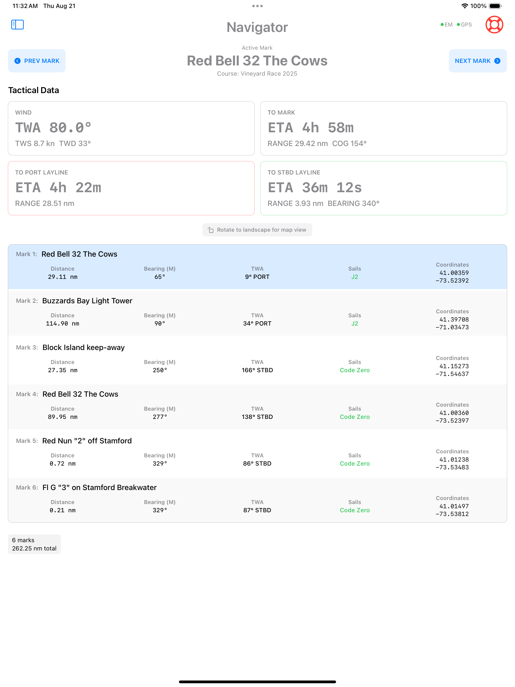

Electronic maps display your position, race course overlay, and nearby buoy wind data. Mark waypoints with TWA information to plan routing based on forecasted conditions along your course.

  

<!-- Section - Weather Observations and Analytics -->
## Weather Observation and Analytics
<strong>Unlock the Real Race Weather Edge with SailWatchPro</strong> 
Weather forecasts begin to degrade the moment they're published. Savvy navigators know that understanding spatial and temporal inaccuracies is often the difference between leading the fleet and chasing it.
In their limited spare time (when not sleeping), most navigators juggle GRIB viewers, surf buoy data on their phone, and scribble notes about shifting winds—trying to build a big-picture view of what's really happening across the race area. Boat instruments are great, but your boat is essentially just one moving buoy—it can't show you the larger view.
  

<strong>SailWatchPro changes the game</strong> 
Once you select your race course, the software automatically defines the race area and identifies the most relevant weather observation stations. With a simple set-it-and-forget-it setup, it periodically fetches the latest buoy data at your chosen interval—no more manual hunting.  

### **Weather Station Wind Analysis**

  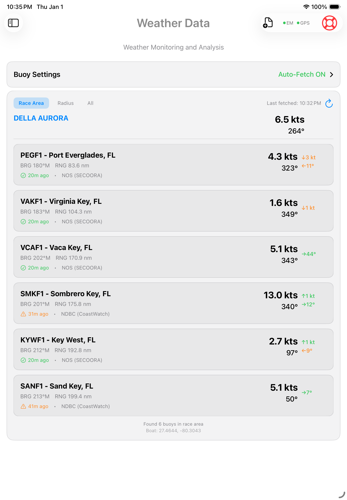

<strong>Visually overlay the actual weather with the GRIB forecasted and predicted trends</strong> 
Import your GRIB files, and SailWatchPro overlays predicted vs. actual weather for every key station, tracking how reality is diverging from the forecast in real time.  Also included is a linear regression analysis of buoy data history to provide an additional predictive dataset.  

  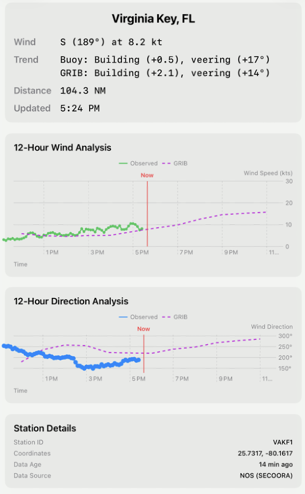

In addition to the fixed buoys, your boat is a moving weather station, and its instruments provide valuable information.  Wind is best described as a moving lawn sprinkler that oscillates as it travels from one place to another.  Sailboat teams that can correctly quantify the oscillations within the larger movement gain a distinct advantage in getting longer lifts and smaller knocks.

### **Boat Instrumentation Wind Analysis**

 

Real-time wind trend analysis using rolling averages, FFT, and wavelet transforms. The app identifies patterns such as veering, backing, building, and oscillating conditions and displays them with confidence indicators. Maintains a 6-hour wind history that automatically syncs across all crew devices on your boat's network.

See exactly where, when, and how the wind, pressure, or other elements are shifting differently than expected—across the entire race area.
Stop guessing. Start knowing.  Gain the advantage the fleet can't see coming.

## 🏁 Competitor Tracking and Threat Assessment
<strong>Know the Real Score Mid-Race with SailWatchPro's Fleet Intelligence</strong> 
After the start gun, the real race begins: Where are your competitors, and how are you actually performing against them on handicap?
Competitor boat performance often reveals the fastest path—which side of the course to favor, which areas to avoid. Basic AIS gives you range, bearing, SOG, and COG for each boat… but SailWatchPro goes much further.
  
For handicapped racing, the software calculates live corrected time for every competitor against you as the race unfolds. 

<strong>See instantly:</strong>
<ul>
  <li>If you're beating a boat that's physically ahead (gaining on corrected time)</li>
  <li>Or losing to one that's behind (they're pulling away despite position)</li>
</ul>

<strong>It also tracks lateral separation across the fleet—so you can visualize who's leveraged to windward/leeward and decide:</strong>
<ul>
  <li>Time to take a risk and leverage hard for a comeback?</li>
  <li>Or play it safe, cover the fleet, and cross the line to the podium?</li>
</ul>

  
  <!--  -->

With the automated ORC interface, select the scoring method once the Race Committee announces it. SailWatchPro automatically downloads the TCFs for all registered boats. No more tedious manual entry.
Enter your competitors' boat details once into a CSV file, then select the competitor you're racing against for any given race. Effortless fleet awareness lets you sail smarter, react faster, and win more.
Stop guessing your position on handicap.  Start knowing—and acting on it—in real time.

## Strategic and Tactical Advisories
<strong>Cut Through the Data Noise with SailWatchPro's Advisory Workbench</strong> 
With modern racing sailboats, information overload is almost inevitable. Sensors and systems pump out data multiple times per second—polars, targets, laylines, currents, leeway, wind shifts—and it's all too easy to get lost in the trees and lose sight of the forest.  The SailWatchPro Advisory Workbench delivers a customizable, centralized dashboard of high-value insights automatically extracted from your live data streams—so you can focus on steering, trimming, and tactics instead of mental math.

<strong>A few examples of always-on advisories:</strong> 
Continuously compares Speed Through Water (STW) to Speed Over Ground (SOG) and alerts you when you're pushing too much current (or getting a free ride).
Tracks your desired heading to the next mark against actual Course Over Ground (COG), warning you the moment you're being gradually knocked off your line by leeway or current.

 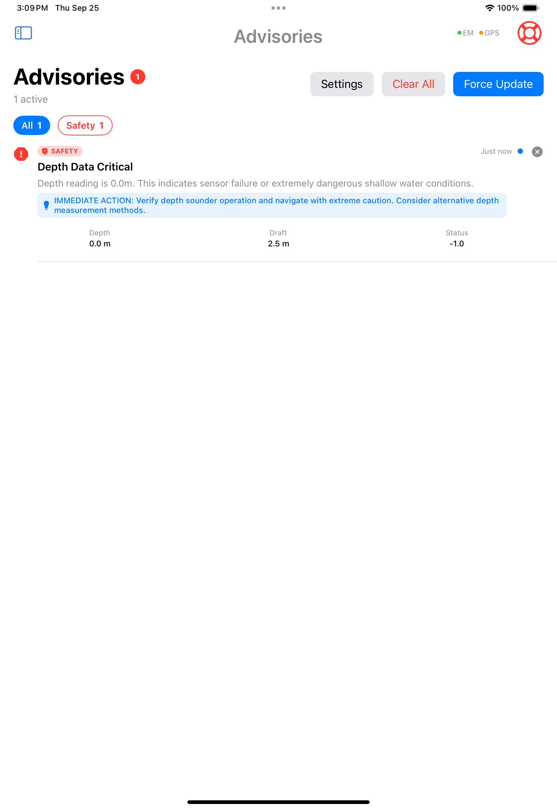

These are just two of many preconfigured, extensible advisories—tailor them to your boat, your crew, and your race strategy.
Sure, you can get this information by staring at mast displays, scribbling notes, and doing constant mental calculations…
But why burn brainpower when SailWatchPro can watch it for you, 24/7, and only interrupt when it matters?
Stay ahead of the fleet. Stay focused on the race.

### 📊 **Customizable Dashboards**

### Racing Dashboards
The app includes 12 different dashboard layouts that display any Expedition Marine channel. Configure them for different race scenarios—pre-start, upwind work, reaching, or offshore. Fields show context-aware data based on sailing mode and provide visual alerts for out-of-range conditions.  In addition, SailWatchPro includes many more computed channels derived from Expedition channel data, including those maintained by the Averaging Engine.  Adding more computed channels is straightforward.

  <strong>Select any channel, including computed channels derived from Expedition Marine Channels</strong> 

  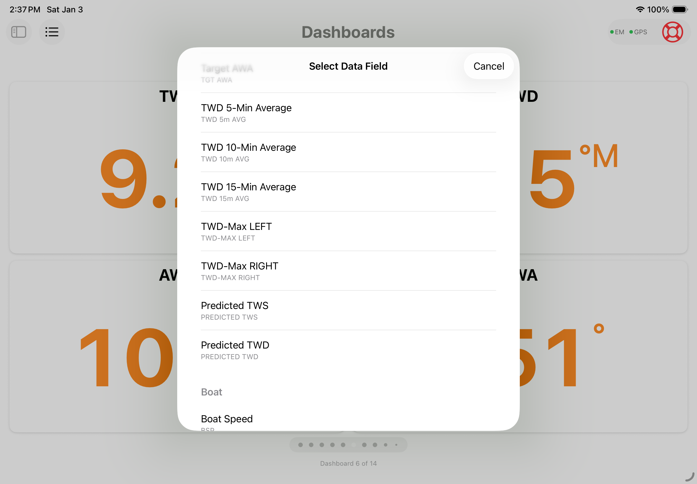

---

  <strong>Prestart Dashboard Example</strong> 

  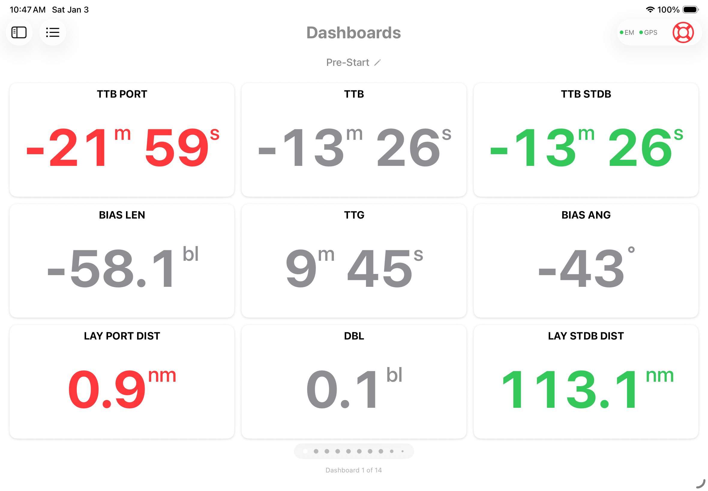

---

  <strong>Buoy Racing Dashboard Example</strong> 

  

---

  <strong>Offshore Racing Dashboard Example</strong> 

  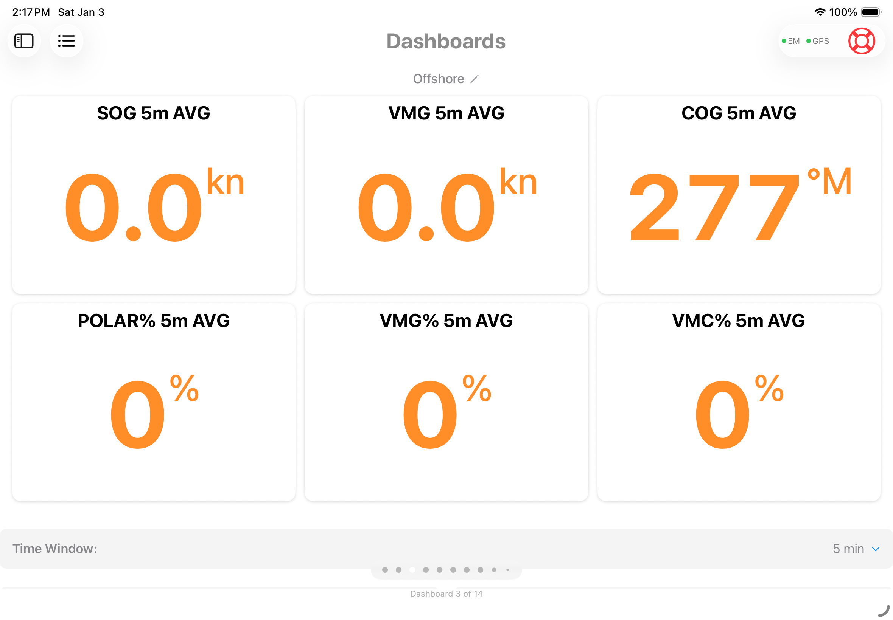

---

  <strong>Driver Performance Dashboard Example</strong> 

  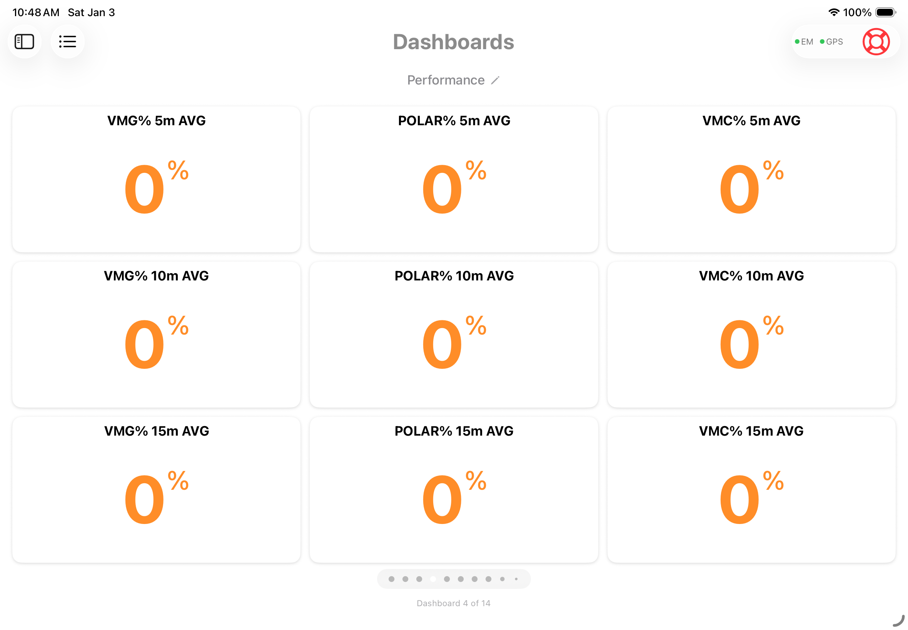

---

  <strong>Four Channels</strong> 

 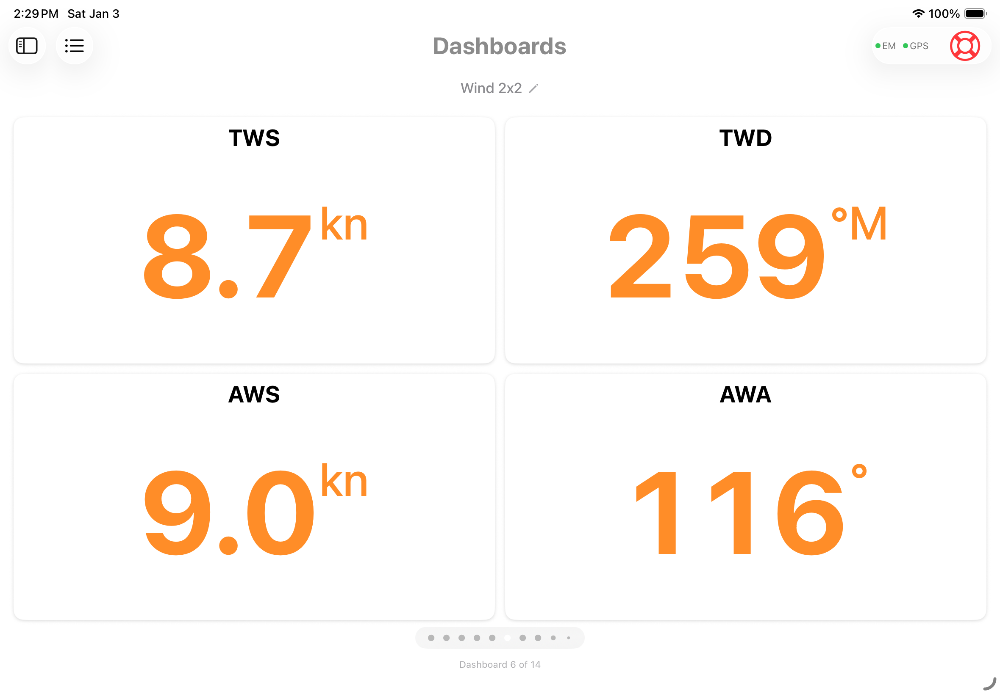

---

  <strong>Two Large Channels</strong> 

 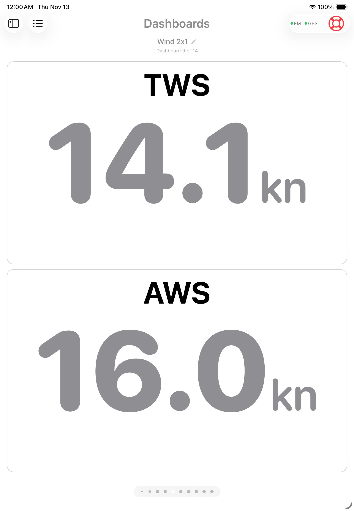

---

  <strong>One Large Channel</strong> 

 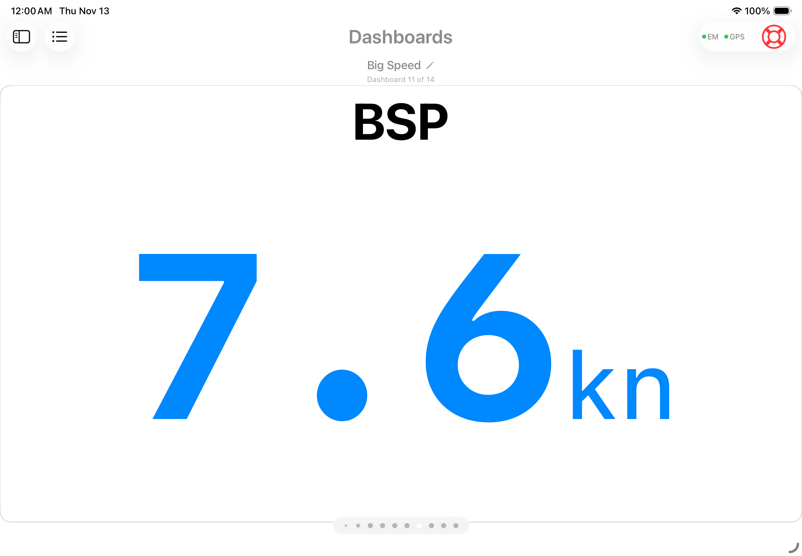

  <strong>Build your own custom names in custom order</strong> 

 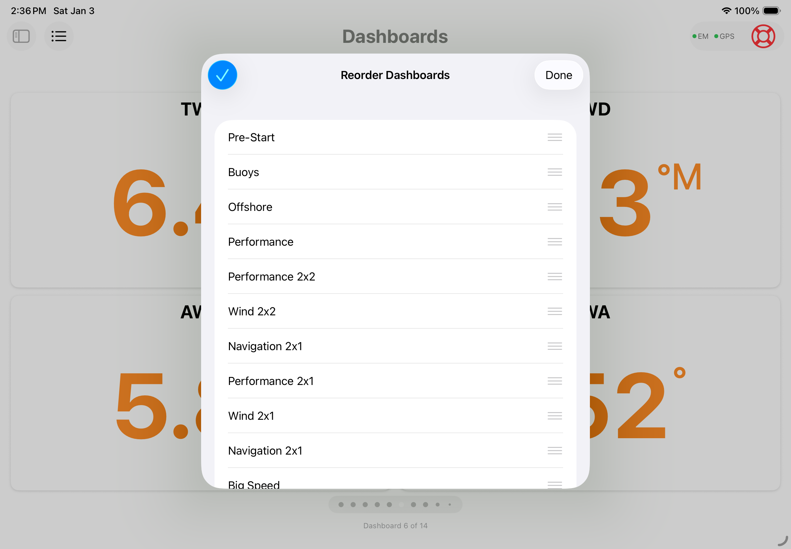

### ⌚ **Apple Watch Integration**

 

Dedicated watch views for race timer, speed, heel angle, VMG, wind angles, and depth.  Also included in access to all custom data fields that comprise dashboards. Data syncs from your iPhone, and the watch automatically shakes and switches to depth monitoring when approaching shallow water.

---

## Additional Capabilities

**Sail Management** – Import designer or performance-based crossover charts. Track sail inventory and log sail change events with time and location data for upload to Sailnjord.

**Weather Data** – Retrieve wind and weather information from NOAA, NDBC, NERACOOS, and LISICOS buoys within 100nm. Data syncs across all devices on your boat's network.

**Barometric Monitoring** – Track atmospheric pressure trends with visual history. The app alerts when pressure data stops updating.

**MOB Function** – Triggers alerts to Expedition and chartplotters, calculates estimated drift position, and provides hypothermia risk assessment.

---

## Technical Overview

SailWatchPro is designed for competitive sailing with features that address common racing scenarios:

- **12 Customizable Dashboards** with any Expedition Marine channel
- **Wind Trend Analysis** using FFT and wavelet transforms
- **Competitor Tracking** with distance and corrected time calculations
- **Start Line Analysis** with pin pinging and bias computation
- **Performance Metrics** with 5/10/15-minute rolling averages
- **Apple Watch Support** with automatic mode switching
- **Display Modes** including night mode with red-tinted display
- **Two-Way Expedition Integration** for marks, courses, and waypoints

---

## Requirements

- iOS 18.5+ (iPad/iPhone) | watchOS 11.5+ (Apple Watch)
- Expedition Marine 12.5.11+ - keeping current with the latest Expedition Marine release is encouraged.
- Reliable boat WiFi network

---

## Pricing & Availability

SailWatchPro is currently in limited beta with a small group of competitive boats.  
Full release and pricing details coming soon — contact us for early access or to join the beta.

**Request Beta Access** → [james.bistis@icloud.com](mailto:james.bistis@icloud.com?subject=SailWatchPro%20Beta%20Access%20Request)  
or email directly: james.bistis@icloud.com

[Report Issues & Suggestions →](https://github.com/jbistis/SailWatchPro-Public/issues)

---

## Getting Started

1. **Connect** – Configure your Expedition Marine network settings
2. **Setup** – Enter boat parameters (length, draft, MMSI)
3. **Customize** – Select dashboard layouts for your racing style
4. **Use** – Access real-time data during races

[Full setup guide available here](https://docs.google.com/document/d/1cXRDmIqwttnDQbBGQB0azVdZFzVpno5fVTCnSREfSbo/edit?usp=sharing)

---

## Feedback & Support

SailWatchPro is actively developed based on user feedback from competitive sailing environments.

**[Report Issues & Request Features →](https://github.com/jbistis/SailWatchPro-Public/issues)**

---

*May you always find the favorable shift.*

**– The SailWatchPro Team**

