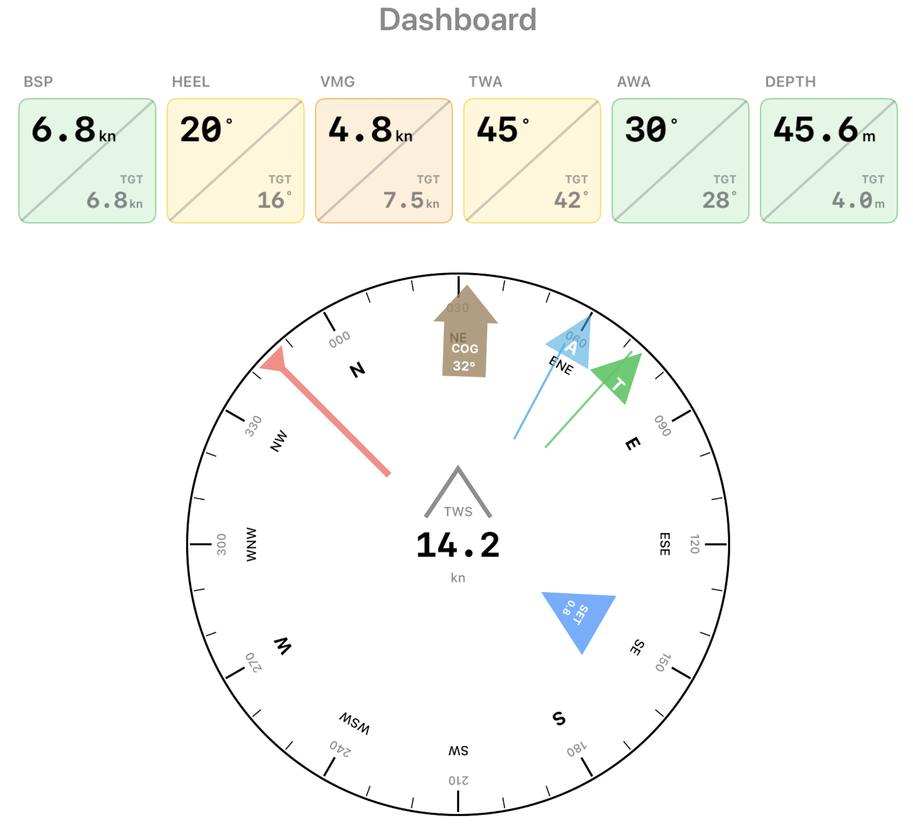
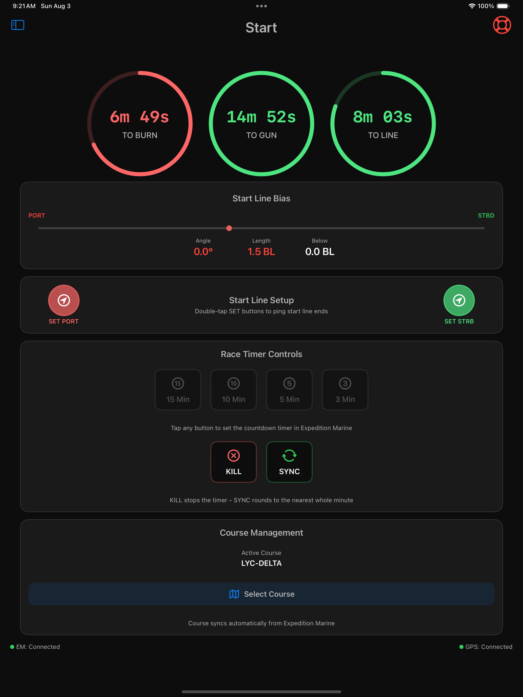

# SailWatchPro-Public

*The Complete Racing Companion for Serious Sailors*

---

## Welcome to SailWatchPro

Welcome to SailWatchPro, your ultimate companion for competitive sailing. Designed to integrate seamlessly with Expedition Marine, SailWatchPro delivers real-time racing insights, precise wind analysis, and tactical decision support. Whether you're navigating tight buoy races or tackling offshore challenges, SailWatchPro equips you with critical data exactly when you need it, empowering you to make informed decisions and optimize performance on the water.

---

## Core Features Overview

### 📊 Dashboard - Your Data Command Center
*The main hub for all critical sailing data*

   

- **Wind Data**: Real-time true and apparent wind speed/direction
- **Performance Metrics**: Boat speed, VMG, polar performance percentages
- **Navigation**: Mark bearings, distances, and ETA calculations
- **Course Info**: Current heading, COG, leeway, and set/drift
- **Safety Data**: Depth readings with color-coded safety indicators
- **Custom Data Fields**: Personalized data display

**Key Insight**: The dashboard automatically switches data priorities based on your sailing mode (upwind/reaching/downwind) and provides color feedback based on out of bounds conditions.

### ⏱️ Start - Pre-Race Excellence
*Pre-start data view to provide precision timing and line analysis from Expedition Marine*

 

**Race Timers**
- **To Gun**: Time until race start
- **To Burn**: Time until you should begin your approach
- **To Line**: Time until you should cross the starting line
- **Elapsed**: Race time after the gun (when race is active)

**Start Line Setup**
- **Set Port/Starboard Pins**: Double-tap buttons to ping start line ends to Expedition
- **Line Bias Analysis**: Real-time bias angle and length in boat lengths
- **Distance Below Line**: Safety indicator showing your position relative to the line

**Timer Controls**
- Set countdown timers (15, 10, 5, 3 minutes)
- **KILL**: Stop active countdown
- **SYNC**: Round timer to nearest whole minute
- **Course Selection**: Load race courses from Expedition

### 🧭 Tactician - Smart Racing Decisions
*Advanced tactical analysis for competitive racing*

- **Layline Analysis**: Distance and time to laylines
- **Wind Shift Detection**: Automatic trend analysis with confidence indicators
- **Lift/Header Identification**: Real-time sailing angle optimization
- **Mark Strategy**: Next mark analysis with optimal sail and angle recommendations
- **Competitor Awareness**: Track nearby boats and their relative positions and threat level - Coming Soon

### 🗺️ Navigator - Course Management
*Professional navigation and course planning*

 

- **Electronic Map Display**: Real-time position with course overlay and buoy wind data
- **Waypoint Management**: Mark positions and distances
- **Course Planning**: Integrated race course display
- **GPS Tracking**: Precise position data with speed over ground
- **Routing Analysis**: Optimal course suggestions based on conditions

### 🌬️ Wind - Advanced Wind Analysis
*Comprehensive wind monitoring and trend analysis*

 

**Real-Time Wind Cards**
- **Wind Data Manager**: Seamlessly manage wind instrument data and share and share amoung your crew. Each connected device maintains a rolling wind database, initialized when the first device launches the app and capturing real-time wind instrument readings. The database accumulates and maintains a rolling 6 hours of wind instrument data over time. New devices sync with the longest-running device to acquire all data collected since the longest-running device started. If the longest-running device exits, the next longest-running device becomes the sync device, maintaining seamless synchronization of the 6 hour database for new connections without disrupting the distributed database.
 
- **TWD**: True Wind Direction (degrees)
- **TWS**: True Wind Speed (knots)  
- **Wind Trend Analyzer**: Current shift pattern with confidence indicator.

**Vertical Strip Charts**
- **Time-based Analysis**: Configurable time windows (2 min to 6 hours)
- **Rolling Average**: Smoothed trend line showing underlying patterns
- **Statistical Data**: High, low, and average values for each parameter
- **Tactical Insights**: Identify wind shifts before they fully develop

**Chart Features**
- **Green Line**: Raw wind data showing all fluctuations
- **Magenta Dotted Line**: Rolling average for trend identification
- **Background Grid**: Easy reference for value and time scales
- **Interactive Time Selection**: Tap time labels to adjust viewing window

### ⛵ Performance Analysis Tools

**Sail Crossover**
- Optimal sail selection based on current conditions
- Performance comparisons between sail options
- Wind range recommendations for each sail

**Polars**
- Real-time polar performance analysis
- Target speeds and angles for current conditions
- Performance percentage against theoretical maximums

**Sails**
- Import your Expedition Marine xml for Sail inventory management.
- Sail events and usage tracking and performance data with export to Sail Analytics.

### 🌡️ Weather Tools
- **Weather Data Manager**: Any user can retrieve wind and weather data, including historical data, from buoys within 100 nautical miles of your boat’s position. The app shares the latest buoy readings with all crew members through the boat’s local WiFi network. When any user refreshes the data, the updated readings are automatically shared with all app users on the same network, ensuring all decision-makers view the same dataset.  To date, we have extrated weather data from NDBC buoys from NOAA CoastWatch ERDDAP (standard NDBC network), NDBC stations via AXDS ERDDAP, LISICOS buoys (UConn direct) using OCR, NERACOOS datasets (Gulf of Maine area), and NDBC stations available through NERACOOS. We can easily adapt more buoys as required. The Navigator view map overylays the buoy data with the boat's current position and race course so your Navigator can investiage the wind trends of nearby future locations to help optimze the route.

- **Buoy Data**

 

**Barometer**
- Real-time atmospheric pressure monitoring
- Trend analysis with historical data
- Weather pattern prediction support

- Comprehensive weather information
- Integration with nearby buoy data including OCR if needed
- Historical weather pattern analysis

### 🎯 Advanced Features

**Expedition Control**
- Two-way communication with Expedition Marine
- Course list management
- Mark and waypoint synchronization
- Command history and response logging

**Competitors**
- Real-time competitor tracking
- Relative position analysis
- Performance comparisons
- Tactical advantage identification

**Events**
- Race event logging
- Performance milestone tracking
- Strategic decision documentation

---

## Apple Watch Integration

Your Apple Watch becomes a powerful racing companion with dedicated views:

 

**Watch Features**
- **Race Timer**: Dedicated start sequence display
- **BSP Split Box**: Speed data with performance indicators
- **Heel Angle**: Real-time heel monitoring
- **VMG Split Box**: Velocity made good analysis
- **TWA/AWA Split Boxes**: Wind angle optimization
- **Depth Split Box**: Safety monitoring with alerts
- **Custom Data Fields**: Personalized data display
- **Automatic Page Switching**: Switches to depth page on dangerous conditions

**Watch Connectivity**
- Seamless data sync from iPhone app
- Independent operation during races
- Night mode support for all watch faces

---

## Settings & Customization

### Connection Settings
- **IP Address**: Your boat's network broadcast address
- **UDP Port**: Communication port (typically 5098)
- **Test Mode**: Use simulated data for training

### Boat Configuration
- **Boat Name**: Your vessel identification
- **Boat Length**: Used for distance calculations in boat lengths
- **Draft**: Critical for depth safety calculations
- **TWA Reaching Threshold**: Sailing mode detection sensitivity

### Display Options
- **Light Mode**: Uses traditional dark text on a light background
- **Dark Mode**: Inverts the color scheme displaying light text on a dark background
- **Night Mode**: Red-tinted display for night vision preservation
- **Chart Time Windows**: Customizable data history viewing
- **Map Style**: Choose between hybrid, standard, satellite, or imagery views

### Safety Settings
- **Depth Alerts**: Automatic warnings based on draft + safety margin
- **Audio Countdown**: Spoken start sequence announcements
- **MOB (Man Overboard)**: Emergency position marking and tracking

---

## Tips for Racing

### Start Line
1. **Set your pins early** in the race preparation sequence
2. **Monitor line bias continuously** - it changes with wind shifts
3. **Use the "Distance Below Line" indicator** to avoid OCS

### Wind Analysis
1. **Watch the rolling average line** for underlying wind trends
2. **Use longer time windows** (10+ minutes) for strategy, shorter (2-5 minutes) for tactics
3. **Monitor wind trend confidence indicators** - higher confidence = more reliable shift
4. **Combine wind data with competitor analysis** for tactical decisions

### Performance Optimization
1. **Check polar percentages regularly** to ensure optimal performance
2. **Use VMG data** for upwind/downwind optimization
3. **Monitor heel angle** for optimal sail trim
4. **Track depth closely** in shallow water racing

### Data Management
1. **Start with test mode** to familiarize yourself with interfaces
2. **Configure time windows** based on your racing style and conditions
3. **Use night mode** for dawn/dusk racing and night sailing
4. **Keep critical data cards** in your primary views

---

## Troubleshooting

### Connection Issues
- **Red status indicators**: Check IP address and UDP port settings
- **No data reception**: Verify Expedition Marine is broadcasting data
- **Intermittent connection**: Check WiFi signal strength and network stability

### Display Problems
- **Data not updating**: Restart Expedition Marine or the UDP connection in settings
- **Charts not displaying**: Verify time window settings and available data
- **Watch not syncing**: Check iPhone-Watch connectivity and app permissions

### Performance Issues
- **Slow response**: Reduce chart time windows or restart the app
- **Battery drain**: Use night mode and reduce display brightness
- **Memory issues**: Clear old event logs and restart periodically

---

## System Requirements
- **iPad**: iOS 18.5 or later
- **iPhone**: iOS 18.5 or later
- **Apple Watch**: watchOS 11.5 or later
- **Expedition Marine**: 12.4.12 or later
- **Network**: Reliable WiFi connection for real-time data with a wired connection for the Expedition Marine PC

---

## Getting Started

### First Launch Setup

1. **Configure the Expdition Marine Network**
  - Start Expedition Marine on boat PC.
  - From the ☰ Hamburger Menu > drag down and hover over Instruments > click on Number of network connections
  - Enter one greater than the number displayed to add one more network > click OK
  - From the ☰ Hamburger Menu > drag down and hover over and click Instruments
  - Select the Network you just created and enter the following
  - Alias - SailWatchPro
  - Instruments - Expedition
  - Address - 192.168.XXX.YYY where this is the IP address of your Expedition Marine PC.
  - Port - Select any port that is not used by another Expedition Marine network.
  - Click Expedition Settings
  - Click Exp Rx filter and select the Receive marks check box.
  - Click Exp Tx filter and select the channels noted in Appendix A down below.

1. **Connect to Expedition Marine**
  - Install the app on your iOS device.
  - Open Settings and configure your boat's WiFi network details.
  - Set the IP address to match the Expedition Marine network IP address you set in the previous step.
  - Set the UDP port to match the Expedition Marine network port you set in the previous step.
  - Exit the app and restart to enable the connection and look for green status indicators.

2. **Configure Your Boat**
  - Enter your boat name
  - Set boat length (for distance calculations in boat lengths)
  - Set draft (for depth safety alerts)
  - Adjust TWA reaching threshold for sailing mode detection

3. **Choose Your Display Mode**
  - **Night Mode**: Red-tinted display for night sailing
  - **Test Mode**: Use simulated data for testing and demos

## Expedition Marine Requirements

## Exp Rx filter
Enable Receive marks

## Exp Tx filter
AWA, AWS, BSP, Cog, Course, Current Drift, Current Set, Depth,
Mark lattitude, Mark longitude, Mark range, Mark time, Mark twa,
Next mark awa, Next mark aws, Next mark bearing, Next mark latitude, Next mark longitude,
Next mark polar time, Next mark range, Next mark time on port, Next mark time on starb, Next mark tws,
Opposite track, Polar bsp, Polar bsp %, Sail mark, Sail next mark, Sog,
Start bias length, Start distance below line, Start layline on port, Start layline on strbd, Start line square wind,
Start port latitude, Start port longitude, Start stbd latitude, Start stbd longitude,
Start time to burn, Start time to gun, Start time to layline P, Start time to layline S, Start time to line,
Start time to port, Start time to strb, Target bsp, Target twa, Target bsp %, Target twa, Trim (pitch) rate,
TWA, TWS, TWS, VMC, VMC %

---

## Support & Updates

SailWatchPro is continuously updated with new features and improvements based on user feedback and racing experience. Regular updates include enhanced analytics, new data visualizations, and improved integration with marine electronics.

For the best racing experience, ensure both your iPhone and Apple Watch apps are updated to the latest versions.

Support: https://jbistis.github.io/SailWatchPro-Public/

---

*Happy sailing and may you always find the favorable wind shift!*

**SailWatchPro Team**
