# SailWatchPro

  
    
  <strong>Win More Races. Make Faster Decisions.</strong>

  <strong>Request Beta Invite → <a href="#beta-request">Click here</a></strong>

SailWatchPro extends Expedition Marine above-deck with a modern, touch-first iOS interface for iPad, iPhone, and Apple Watch. It synthesizes real-time data into clear, actionable insights and advisories — helping you make faster, more confident decisions on the water.

---

## Key Pillars

- **Race Management** — Pre-start timer and line ping controls with start line visualization, course marks, competitor tracking, sail and crew change event logging, and fully customizable dashboards
- **Wind & Weather Analytics** — Boat instruments + buoys + GRIB fusion, real-time trend analysis using advanced signal processing to identify oscillations, shifts, and building patterns, divergence tracking, and confidence levels
- **Data Management** — Full access to all Expedition channels plus computed channels with 5/10/15-minute averaging — including rolling performance analytics and a 6-hour wind history that syncs across all devices on the boat
- **Strategic & Tactical Advisories** — Smart, actionable alerts continuously monitor your instruments, wind, and weather — recommending sail changes, flagging current push and leeway, tracking barometric pressure trends, GRIB accuracy, dew point risk, and layline overstand — so you can focus on steering and tactics, not watching gauges

---

## Race Management

### Pre-Start & Start Line

Full pre-start and start line suite — precision timing, line bias, pin pings, and a dedicated start area grid showing your position relative to the line, laylines, and optimal crossing point.

<!-- SCREENSHOT: swp-prestart-view-light-v81.png -->

  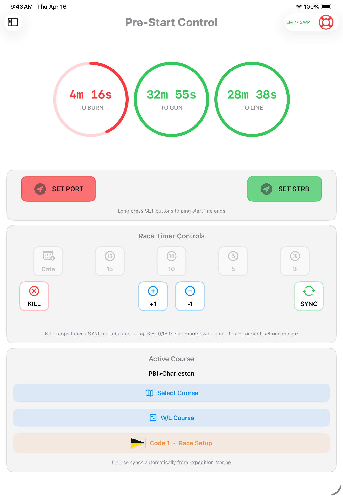
   <em>Pre-Start Dashboard</em>

 

<!-- SCREENSHOT: swp-iPad-start-view-with-cards-light.png — RETAKE on v81+ -->

  
   <em>Start Line Visuals & Bias</em>

 

### In-Race Management

Know exactly where you stand — live corrected time, fleet positioning, course visualization, and mark bearings. Combines competitor tracking with navigator-grade course maps for total tactical awareness.

<!-- SCREENSHOT: swp-navigator-portrait-light.png — RETAKE on v81+ -->

  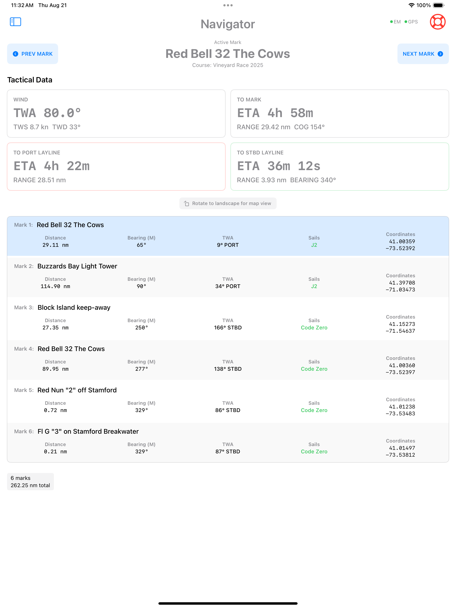
   <em>Course Table View with Mark Bearings and Estimated Wind Angles</em>

 

<!-- SCREENSHOT: swp-buoy-data-pinwheel-view.png — RETAKE on v81+ -->

  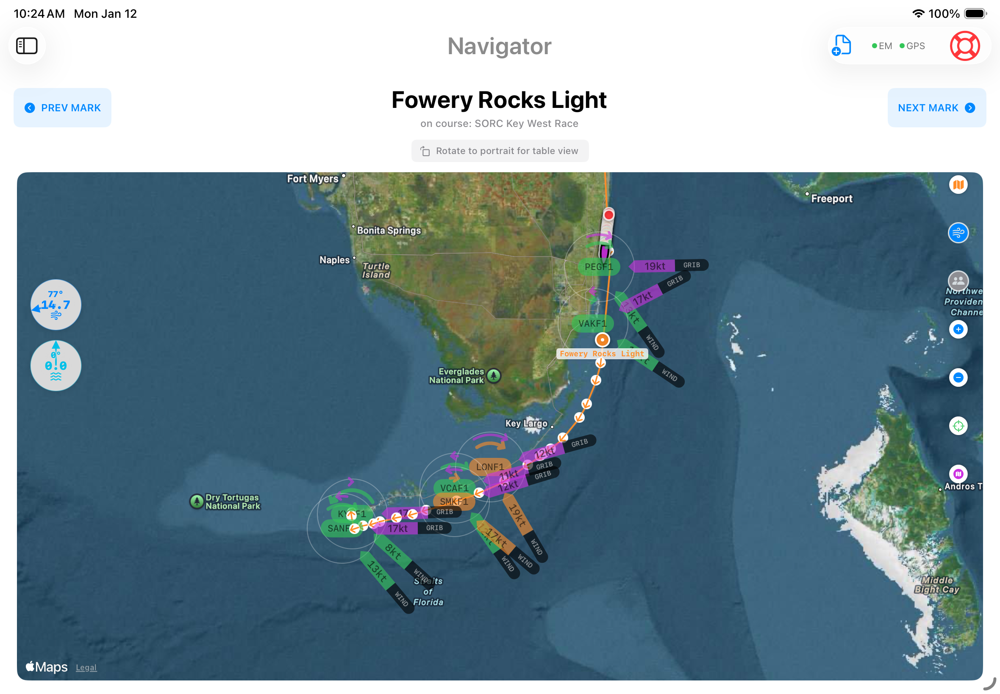
   <em>Course Map with Buoy/GRIB Data and Competitor Heat Map</em>

 

<!-- SCREENSHOT: swp-competitor-view-light.png — RETAKE on v81+ -->

  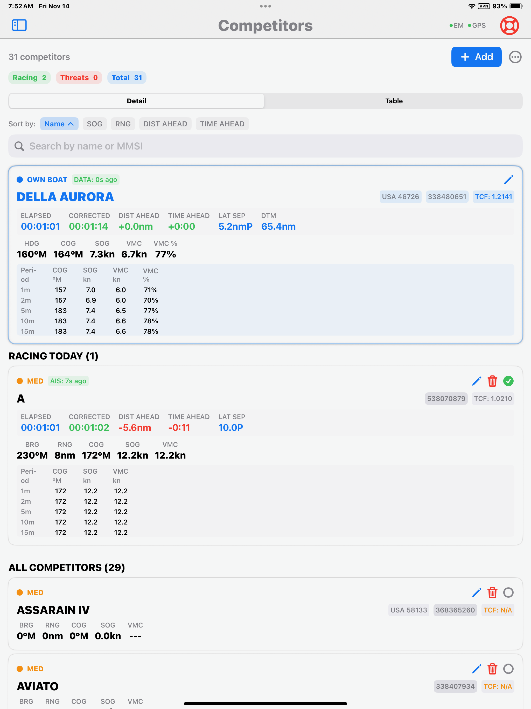
   <em>Competitor tracking with live leaderboard</em>

 

---

## Dashboards

18 fully customizable layouts — select any Expedition Marine channel or computed metric (5/10/15-min averages, polar%, VMG%, VMC%, and more). Context-aware fields switch automatically based on sailing mode (upwind/reaching/downwind) and provide color feedback for out-of-bounds conditions.

<!-- SCREENSHOT: swp-dashboard-select-channels-dashboards-landscape-light.png — RETAKE on v81+ -->

  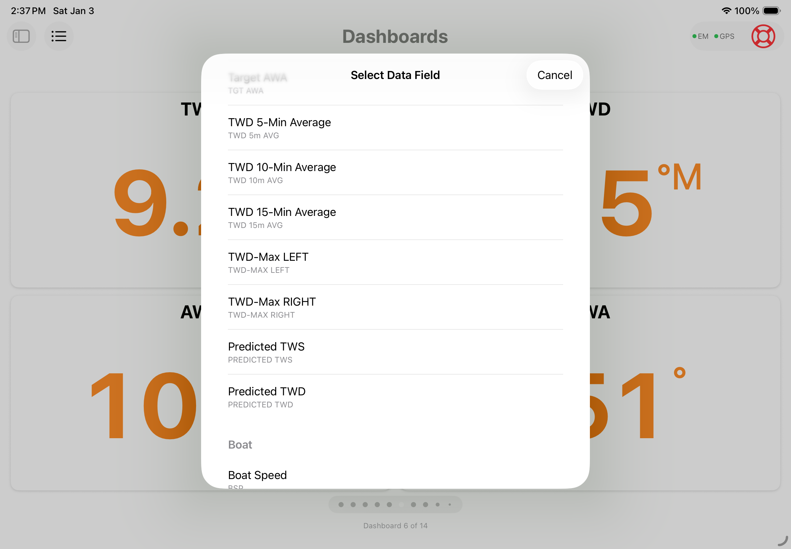
   <em>Select any channel, including computed channels derived from Expedition Marine</em>

 

<!-- SCREENSHOT: swp-dashboard-3x3-prestart-landscape-light.png — RETAKE on v81+ -->

  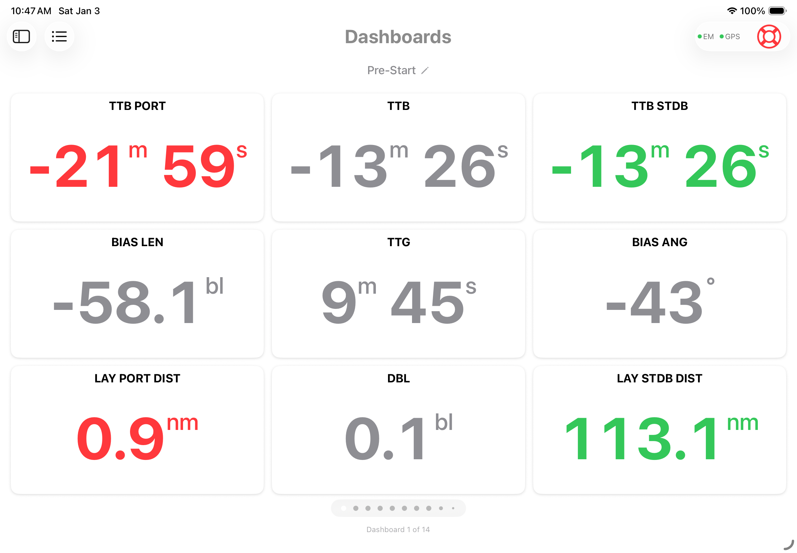
   <em>Pre-Start Dashboard Example</em>

 

<!-- SCREENSHOT: swp-dashboard-3x3-buoy-racing-landscape-light.png — RETAKE on v81+ -->

  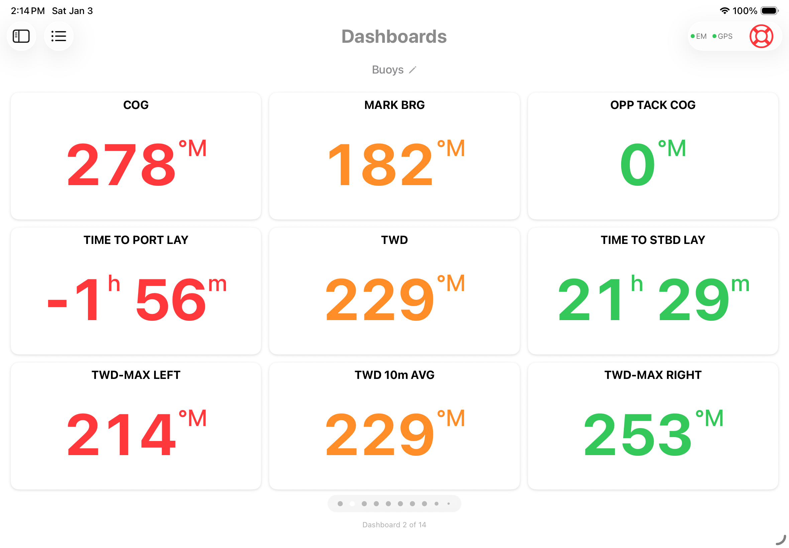
   <em>Buoy Racing Dashboard Example</em>

 

<!-- SCREENSHOT: swp-dashboard-3x3-offshore-racing-landscape-light.png — RETAKE on v81+ -->

  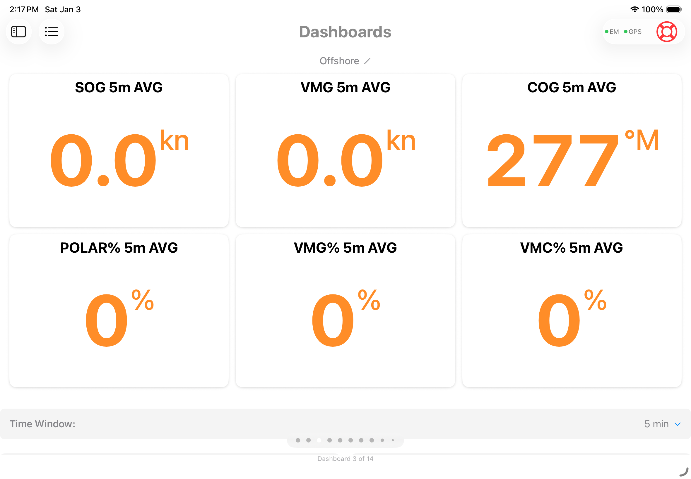
   <em>Offshore Racing Dashboard Example</em>

 

<!-- SCREENSHOT: swp-dashboard-3x3-performance-landscape-light.png — RETAKE on v81+ -->

  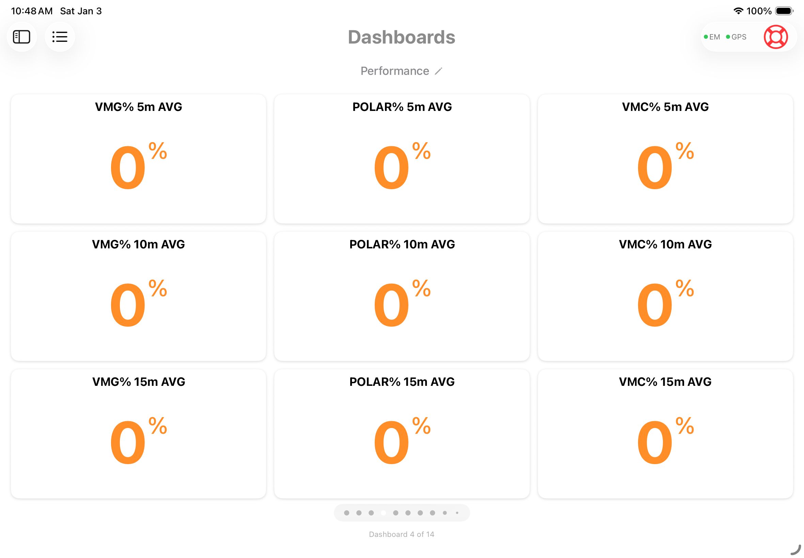
   <em>Driver Performance Dashboard Example</em>

 

<!-- SCREENSHOT: swp-dashboard-reorder-dashboards-landscape-light.png — RETAKE on v81+ -->

  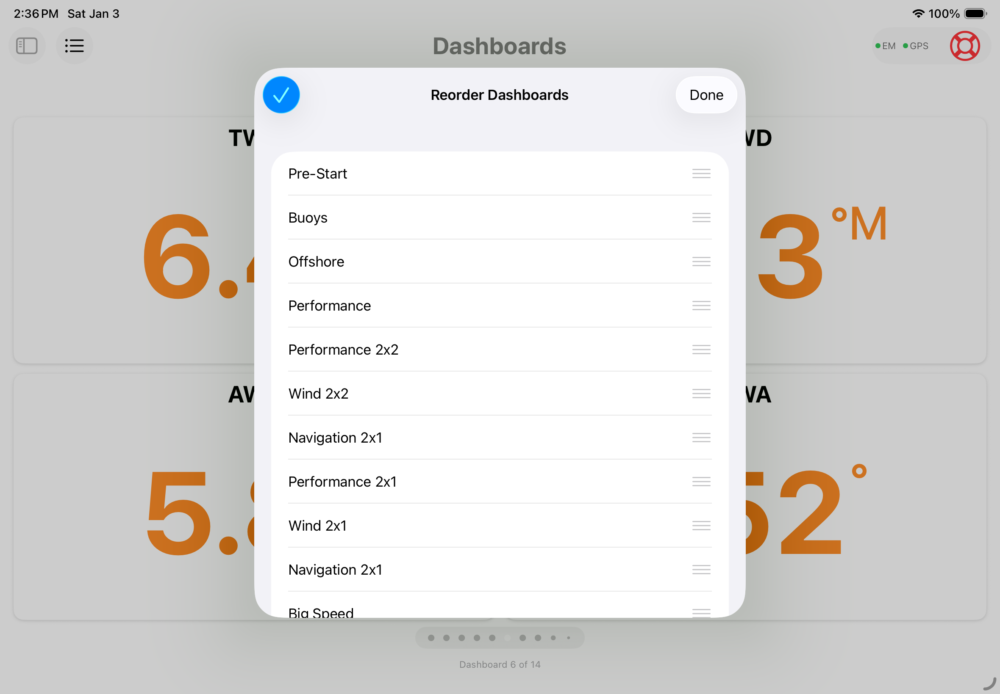
   <em>Build custom dashboard names in any order</em>

 

---

## Wind & Weather Analytics

### Weather Station Network

Automated buoy polling from NOAA/NDBC stations, overlaying predicted GRIB data with actual observations to track divergences across the race area in real time.

<!-- SCREENSHOT: swp-buoy-list-view-light.png — RETAKE on v81+ -->

  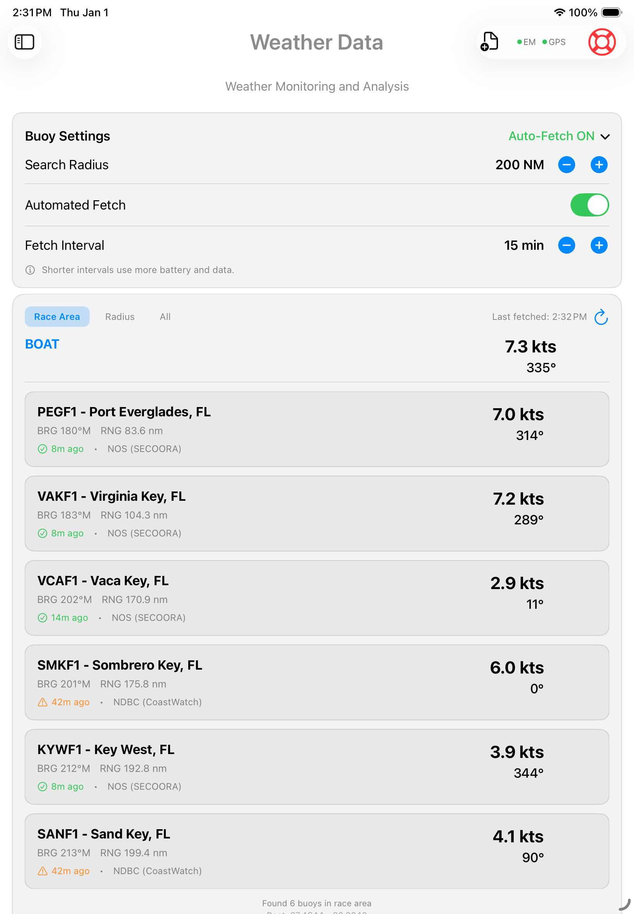
   <em>Automated recurring buoy data fetching</em>

 

<!-- SCREENSHOT: buoy-observed-grib.png — RETAKE on v81+ -->

  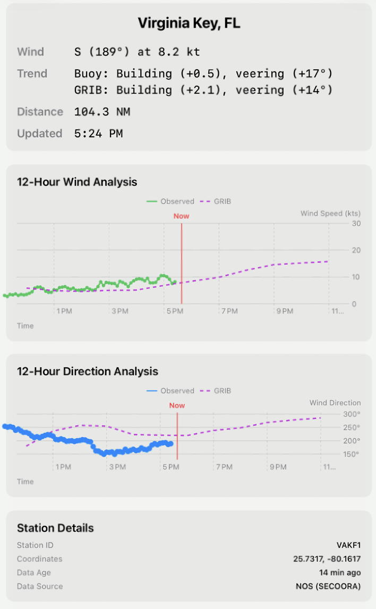
   <em>Buoy: Predicted vs. Actual Wind Trends</em>

 

### Boat Instrumentation Wind Analysis

Your boat is a moving weather station. SailWatchPro analyzes real-time wind trends using advanced signal processing to identify veering/backing, building, and oscillating patterns — with confidence indicators and a 6-hour wind history that syncs across devices.

<!-- SCREENSHOT: swp-wind-state-v76.png — CRITICAL: KNOWN OLD VERSION. Retake on v81+ as swp-wind-state-v81.png -->

  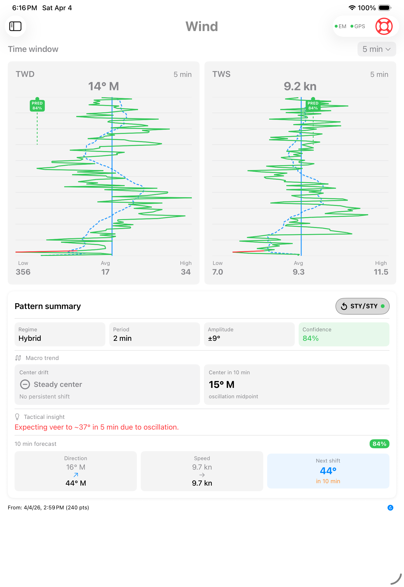
   <em>Wind trend analysis from boat instruments</em>

 

<!-- SCREENSHOT: swp-boat-location-forcast-portrait-light.png — RETAKE on v81+ -->

  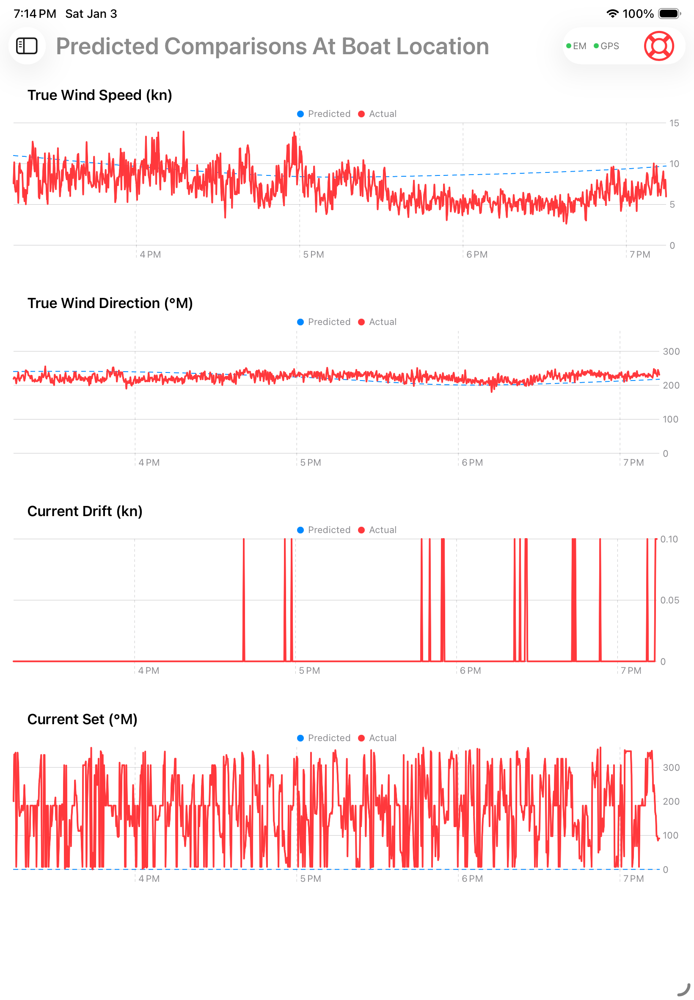
   <em>Boat: Predicted vs. Actual Wind Trends</em>

 

### Coastal Effects

The Wind view includes a Coastal Effects section that predicts the likelihood of sea breeze, land breeze, and friction shift effects on your racing area. Uses Open-Meteo (free, no account required) — an internet connection is required. The nearest coastal land point is determined automatically from the boat's GPS position. Data refreshes once per hour; tap the refresh icon in the card header to force an immediate update.

<!-- SCREENSHOT: MISSING — NEW FEATURE v81. Retake as swp-coastal-effects-v81.png -->

---

## Sail & Crew Event Logging

Log sail changes and crew position changes with one tap. SailWatchPro instantly sends events to Expedition Marine and keeps your entire crew in sync across iPads, iPhones, and Macs.

<!-- SCREENSHOT: swp-sails-up.png — RETAKE on v81+ -->

  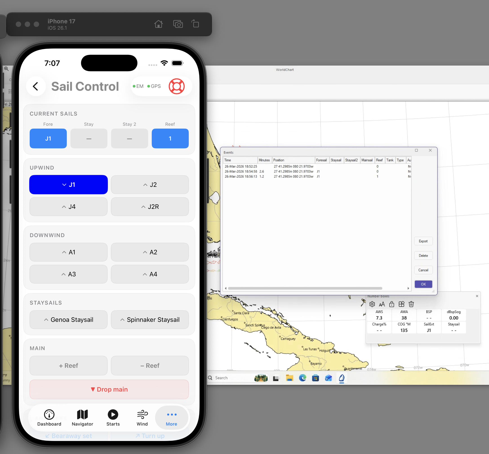
   <em>Sail changes communicated instantly to Expedition Marine</em>

 

<!-- SCREENSHOT: swp-crew-positions-iPhone.png — RETAKE on v81+ -->

  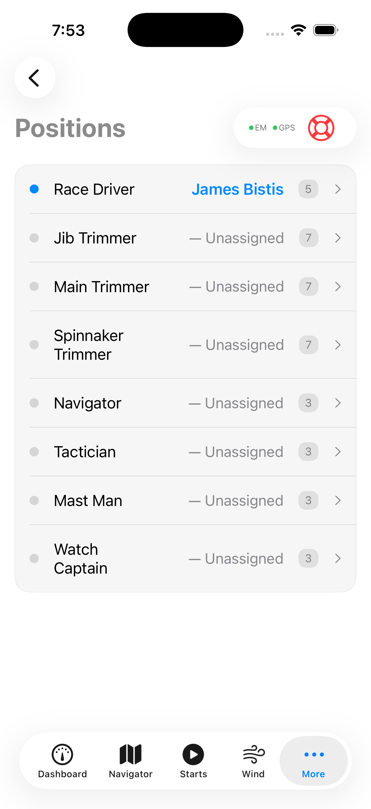
   <em>Custom position titles with crew eligibility enforcement</em>

 

---

## Strategic & Tactical Advisories

Smart, actionable alerts continuously monitor your instruments, wind, and weather — recommending sail changes, flagging current push and leeway, tracking barometric pressure trends, GRIB accuracy, dew point risk, and layline overstand — so you can focus on steering and tactics, not watching gauges.

<!-- SCREENSHOT: swp-advisories-light.png — RETAKE on v81+. Should show dew point and coastal advisories. -->

  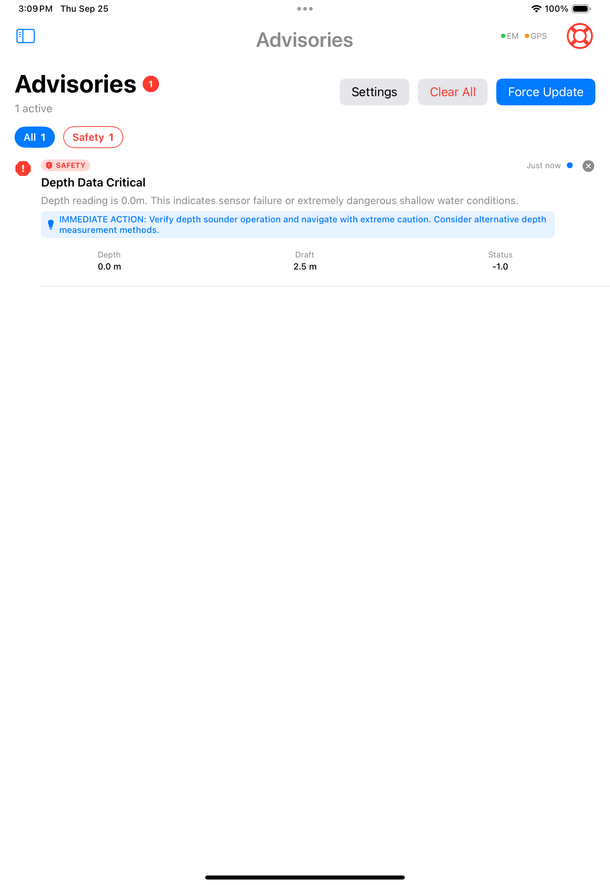
   <em>Advisory panel</em>

 

<!-- SCREENSHOT: swp-mild-current-push-portrait-light.png — RETAKE on v81+ -->

  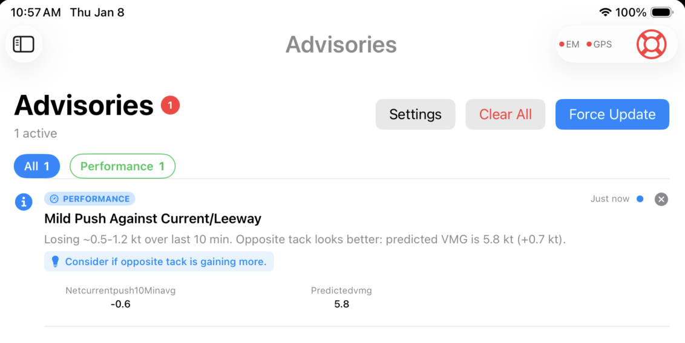
   <em>Current push advisory with opposite tack VMG prediction</em>

 

---

## Apple Watch Integration

Dedicated racing views for timer, speed, heel, VMG, wind, and depth — automatically switches to shallow-water monitoring when depth becomes critical. Most critical advisories pushed directly to your wrist.

<!-- SCREENSHOT: swp-apple-watch-views.png — RETAKE on v81+ -->

  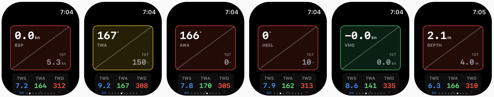

 

---

## Technical Highlights

- GRIB parsing via ECMWF ecCodes bridge
- Advanced signal processing using Morlet wavelet transforms for wind pattern analysis
- 5/10/15-minute averaging engine for any channel
- Two-way Expedition Marine integration
- Coastal Effects predictions via Open-Meteo (internet connection required)
- Night mode with red tint for night vision preservation

---

## Requirements

- **iPad / iPhone:** iOS 18.5+
- **Apple Watch:** watchOS 11.5+
- **Mac (Apple silicon):** macOS 15.6+
- **Expedition Marine:** 12.5.11+ (latest encouraged)
- Reliable boat WiFi
- NMEA 2000 Ethernet Gateway required for competitor tracking via AIS
- Internet connection required for Coastal Effects wind predictions (all other features work fully offline)

---

## Screenshot Retake Checklist (v81+)

All screenshots should be retaken on build v81 or later. Suggested naming convention: `swp-[feature]-v[build].png`

| Feature | Current File | Priority | Notes |
|---------|-------------|----------|-------|
| Pre-Start Dashboard | swp-prestart-view-light.png | High | |
| Start Line Visuals | swp-iPad-start-view-with-cards-light.png | High | |
| Course Table | swp-navigator-portrait-light.png | Medium | |
| Course Map | swp-buoy-data-pinwheel-view.png | Medium | |
| Competitor Tracking | swp-competitor-view-light.png | Medium | |
| Dashboard Channel Select | swp-dashboard-select-channels-dashboards-landscape-light.png | High | |
| Pre-Start Dashboard 3x3 | swp-dashboard-3x3-prestart-landscape-light.png | High | |
| Buoy Racing Dashboard 3x3 | swp-dashboard-3x3-buoy-racing-landscape-light.png | Medium | |
| Offshore Racing Dashboard 3x3 | swp-dashboard-3x3-offshore-racing-landscape-light.png | Medium | |
| Performance Dashboard 3x3 | swp-dashboard-3x3-performance-landscape-light.png | Medium | |
| Dashboard Reorder | swp-dashboard-reorder-dashboards-landscape-light.png | Low | |
| Buoy List | swp-buoy-list-view-light.png | Medium | |
| Buoy vs GRIB | buoy-observed-grib.png | Medium | |
| Wind Analysis | swp-wind-state-v76.png | **Critical** | Known old version — rename to swp-wind-state-v81.png |
| Wind Forecast | swp-boat-location-forcast-portrait-light.png | Medium | |
| **Coastal Effects** | **MISSING** | **Critical** | New feature — swp-coastal-effects-v81.png |
| Sail Changes | swp-sails-up.png | Low | |
| Crew Positions | swp-crew-positions-iPhone.png | Low | |
| Advisories | swp-advisories-light.png | High | Should show dew point and coastal advisories |
| Current Push Advisory | swp-mild-current-push-portrait-light.png | Low | |
| Apple Watch | swp-apple-watch-views.png | Medium | |

---

## Pricing & Availability

SailWatchPro is currently in limited beta with a small group of competitive boats. Full release and pricing details coming soon.

  <strong>Request Beta Invite</strong> 
  Email directly: <a href="mailto:james.bistis@icloud.com?subject=SailWatchPro%20Beta%20Invite%20Request">james.bistis@icloud.com</a> 
  <small>Please include your boat type, racing plans, and Expedition version.</small>

---

## Documentation

[Setup Guide →](SETUP-GUIDE.md)

[User Manual →](USER-MANUAL.md)

[Troubleshooting →](TROUBLESHOOTING.md)

[Report Issues & Feature Requests →](https://github.com/jbistis/SailWatchPro-Public/issues)

---

*May you always find the favorable shift.*  
**— The SailWatchPro Team**
