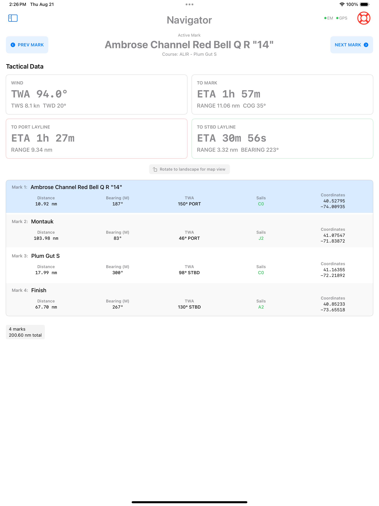
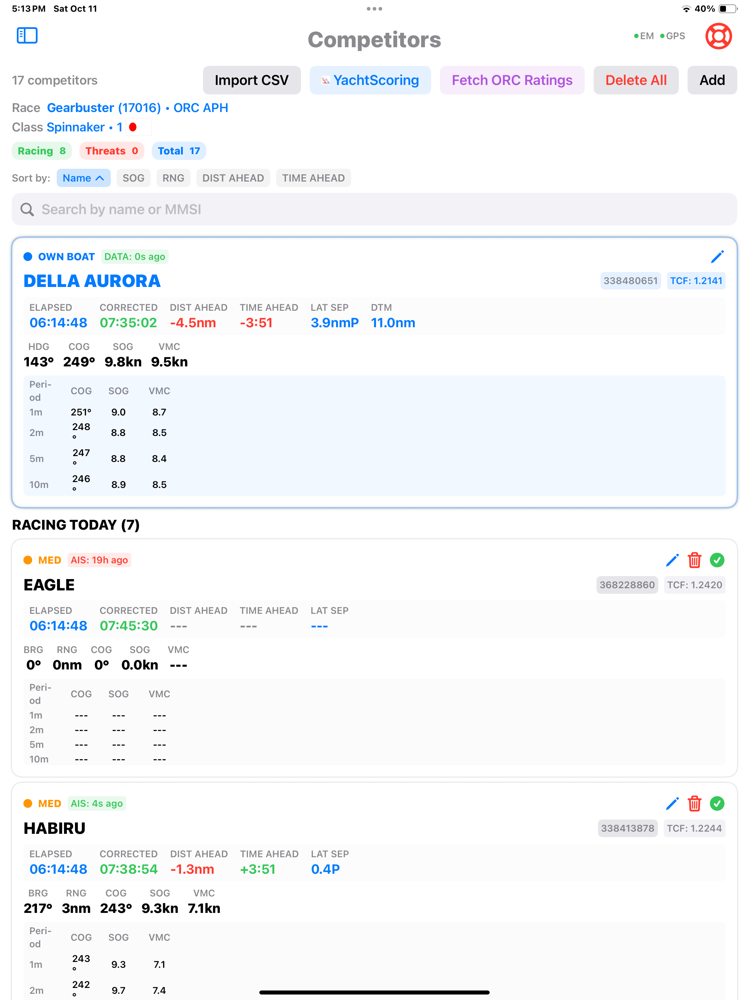

# SailWatchPro

  

 A Complete Racing Companion for Expedition Marine

<!--   <a href="https://itunes.apple.com/us/app/gitpoint/id1251245162?mt=8"> -->
  

---

## Introduction

SailWatchPro extends and enhances Expedition Marine's capabilities, bringing them above deck with a sleek, touch-friendly interface for iPad, iPad Mini, iPhone, and Apple Watch. Built for competitive sailing, SailWatchPro delivers real-time tactical insights by translating critical data—such as wind patterns, boat speed metrics, and course positioning—into clear, actionable information. Whether you're racing around the buoys or navigating offshore, SailWatchPro empowers your team to make fast, confident decisions when every second counts.

---

## Features

### 📊 User-Definable Dashboards
- Any Expedition Marine Channel may be selected as a user-defined field.
- Performance Data Aggregators for cog, sog, vmg, vmg%, vmc, vmc%, polar%, and Target Boat% calculated to 5, 10, and 15 minute rolling averages.
- Wind Shift Detection**: Automatic trend analysis with confidence indicators.
- Lift/Header Identification**: Real-time sailing angle optimization

 
 
 
 
 
   

There are 12 user-defined dashboards.

**Key Insight**: Many dashboard fields also support context-aware switching based on your sailing mode (upwind/reaching/downwind) and provide color feedback for out-of-bounds conditions.

### ⏱️ Pre-Start

The Prestart view is where you may ping the pins, select the racecourse, and set and synchronize the race timer.

 

**Race Timers**
- **To Gun**: Time until race start
- **To Burn**: Time until you should begin your approach
- **To Line**: Time until you should cross the starting line
- **Elapsed**: Race time after the gun (when race is active)

**Start Line Setup**
- **Set Port/Starboard Pins**: Double-tap buttons to ping start line ends to Expedition
- **Line Bias Analysis**: Real-time bias angle and length in boat lengths
- **Distance Below Line**: Safety indicator showing your position relative to the line

**Timer Controls**
- Set countdown timers (15, 10, 5, 3 minutes)
- **KILL**: Stop active countdown
- **SYNC**: Round timer to nearest whole minute
- **Course Selection**: Load race courses from Expedition

**Race Course Management**
- **Course Selection**: Load race courses from Expedition

### ⏱️ Start

The Start view displays the Start Area, showing the boat’s position relative to the start line and pin laylines. It also presents TTG, TTB, TTL, and DTL data for port, center, and starboard, along with a graphical representation of the line bias and the heading to the first mark—helping you determine the optimal place to cross the line.

 

- Start Area Grid
- Wind Strip Charts

### 🗺️ Navigator - Course Management
*Professional navigation and course planning*
- **Electronic Map Display**: Real-time position with course overlay and buoy wind data

  

- **Waypoint Management**: Mark positions and distances with True Wind Angles

  

### 🗺️ Competitor Tracking
*Track competitor position, heading, and speeds in real-time*

  

The CompetitorsModernView is a comprehensive competitor tracking and analysis interface designed for sailboat racing. This view provides real-time competitor monitoring, tactical analysis, and race management capabilities.

## Main Interface Overview

### Header Section
The interface displays key status information at the top:
- **Total competitors count** with breakdown by category
- **Current race information** including race name, ID, scoring system, class, and flags
- **Action buttons** for importing data, adding competitors, and managing the database

### Status Chips
Color-coded status indicators show:
- **Racing** (Green): Number of competitors currently marked as racing
- **Threats** (Red): Number of competitors classified as threats based on proximity and position
- **Total** (Blue): Complete competitor count

### Search and Sorting
- **Search bar**: Filter competitors by name or MMSI number
- **Sort controls**: Sort competitors by multiple criteria (name, distance, threat level, etc.) with ascending/descending options

## Competitor Sections

### Our Boat Section
When your boat is found in the competitor database and marked as racing, it displays:
- **Own boat card** with comprehensive race timing information
- **Elapsed time** since race start
- **Corrected time** calculations using TCF (Time Correction Factor)
- **Tactical position** relative to race course and other competitors

### Racing Competitors
Competitors marked as racing are displayed with enhanced information, including:
- **Real-time position data** (bearing, range, course, speed)
- **Threat level indicators** with color-coded circles
- **AIS data freshness** showing how recently position data was received
- **Race timing** with elapsed and corrected times
- **Rolling averages** for COG, SOG, and VMC over 1, 2, 5, and 10-minute periods
- **Tactical analysis** including distance ahead/behind and lateral separation

### All Competitors
Non-racing competitors are listed separately with basic information and the ability to:
- Toggle racing status
- Edit competitor details
- Delete individual competitors

### Detected Vessels
When enabled, it shows AIS-detected vessels that can be added as competitors:
- **Class A and Class B** vessel filtering
- **Automatic position calculation** for bearing and range
- **One-click addition** to competitor database

## Tactical Analysis Calculations

### DISTANCE AHEAD
The **DISTANCE AHEAD** metric shows the positional advantage between your boat and competitors measured along the race course.

**Calculation Method:**
- Measures the direct distance from each boat to the active race mark
- Subtracts your distance from the competitor's distance to the mark
- **Positive values** (+): You are ahead (closer to the mark than the competitor)
- **Negative values** (-): You are behind (competitor is closer to the mark)
- Displayed in nautical miles with one decimal precision (e.g., "+0.3nm", "-1.2nm")

**Prerequisites:**
- Both boats must be marked as "racing"
- Both boats must have valid GPS positions
- Both boats must be determined to be on the same race leg
- Active mark coordinates must be available

**Same Leg Detection:**
The system uses VMC (Velocity Made to Course) analysis to determine if boats are racing the same leg:
- Both boats must have positive VMC toward the active mark
- VMC difference between boats must be within a reasonable tactical variation
- Boats with strongly negative VMC are considered to be on different legs

### TIME AHEAD
The **TIME AHEAD** metric shows the corrected time advantage/disadvantage in the current race standings.

**Calculation Method:**
1. **Position-Adjusted Corrected Time Analysis:**
  - Calculates each boat's corrected elapsed time using their respective TCF (Time Correction Factor)
  - For boats at different distances from the mark, it projects the time needed for the trailing boat to reach the leading boat's distance to the mark.
  - Uses current VMC to estimate catch-up time
  - Applies TCF to both the current elapsed time and the projected time

2. **Calculation Logic:**
  - If you're ahead by distance: Projects competitor's time to reach your position, then compares corrected times
  - If competitor is ahead: Projects your time to reach their position, then compares corrected times
  - If positions are similar (<100m difference): Uses direct corrected time comparison

3. **Display Format:**
  - **Positive values** (+): You are ahead on corrected time (winning)
  - **Negative values** (-): Competitor is ahead on corrected time (you need to catch up)
  - Formatted as MM:SS for times over 1 minute, or 0:SS for shorter intervals
  - Green text for positive (ahead), red text for negative (behind)

**Prerequisites:**
- Both boats must have valid TCF values from their handicap ratings
- Race must have started (elapsed time available)
- Both boats must have reasonable VMC values (>0.5 knots) for projection calculations
- Boats must be on the same race leg

### Lateral Separation (LAT SEP)
Shows the perpendicular distance from each boat's current position to the rhumb line:
- **Positive values with "P"**: Boat is to port of the course line
- **Negative values with "S"**: Boat is to starboard of the course line
- Helps identify tactical positioning and potential crossing situations

## Key Features

### Data Import Capabilities
- **CSV Import**: Import competitor lists from spreadsheet files
- **YachtScoring Integration**: Direct connection to the YachtScoring platform for race data
- **ORC Rating Fetch**: Automatic retrieval of ORC ratings and TCF values

### Real-Time Analysis
- **Threat Assessment**: Automatic classification based on proximity and tactical position
- **VMC Calculations**: Velocity Made Good towards the active mark
- **Tactical Positioning**: Distance ahead/behind and lateral separation analysis
- **Time Corrections**: Real-time corrected time calculations using various rating systems

### Race Management
- **Auto-detection**: Automatically identifies and marks your boat as racing
- **Rating Systems**: Support for ORC, PHRF, and other handicap systems
- **Manual TCF Override**: Ability to set custom Time Correction Factors

### Data Quality Monitoring
- **AIS Age Indicators**: Color-coded freshness of position data (green <30s, orange <2min, red >2min)
- **Position Validation**: Automatic filtering of invalid or zero coordinates
- **Rolling Averages**: Smoothed data to reduce noise in tactical calculations

## User Interactions

### Adding Competitors
- Manual entry via the "Add" button
- Import from detected AIS vessels
- CSV file import
- YachtScoring platform integration

### Editing and Management
- **Edit**: Pencil icon for modifying competitor details
- **Delete**: Trash icon for removing individual competitors
- **Toggle Racing**: Circle icon to mark competitors as racing/not racing
- **Bulk Delete**: "Delete All" option with confirmation dialog

### Race Configuration
The view automatically adapts to race settings configured elsewhere in the application:
- Race name and identifier
- Scoring system selection
- Class configuration
- Mark positions for tactical calculations

## Technical Notes

### Data Requirements
For tactical calculations to function properly, the system requires:
- Valid GPS positions for all boats
- TCF values from handicap ratings (ORC/PHRF)
- Active race mark coordinates
- Race start time for elapsed time calculations

### Limitations
- Tactical calculations only apply to boats on the same race leg
- Time projections assume the current VMC will be maintained
- Very low VMC conditions (<0.5 knots) may result in unreliable projections
- Boats with missing TCF values will show "---" for corrected time calculations

This interface provides professional-level competitor analysis capabilities suitable for serious racing sailors who need comprehensive tactical information during races.

### 🗺️ Sails - Inventory and Event Management

**Sail Crossover Chart**

The app supports two types of crossover charts:

<ul>
  <li>Designer Crossover Chart</li>
  
Based on sail usage recommendations from your sailmaker. This chart reflects the theoretical or intended wind ranges for each sail.

  <li>Performance Crossover Chart</li>
  
Built from real sailing data collected during your races or sessions, this view shows the true wind angles (TWA) and true wind speeds (TWS) at which each sail was used. When multiple sails are used in overlapping conditions, the sail associated with the highest boatspeed is shown. This data can be easily aggregated and downloaded from the Sail Analytics, see https://app.sailnjord.com/help/analytics/visualizations/sail-crossover.html?highlight=crossover#sail-crossover

</ul>

  

- **Inventory**: Each time you import a sail crossover chart, the app updates the sail inventory based on the sails found in the XML file. You can then enable or disable sails, or designate which sails are left on shore for any particular race.

  

- **Events**: Once you import your sail chart, you can begin entering Sail Up events with corresponding time and location. The event log file can then be uploaded to https://www.sailnjord.com/.

  

### 🌬️ Wind Analysis
*Comprehensive wind monitoring and trend analysis*

 

**Real-Time Wind Cards**
- **Wind Data Manager**: Manage wind instrument data and seamlessly share it among your crew. When the app starts, each connected device receives a rolling wind database initialized by the first device to launch the app. This database captures real-time wind instrument readings and maintains a continuous 6-hour history. New devices sync with the longest-running device to access all data collected since that device started. If the longest-running device disconnects, the next longest-running device takes over as the sync source—ensuring uninterrupted sharing and synchronization of wind data across the network..
 
- **TWD**: True Wind Direction (degrees)
- **TWS**: True Wind Speed (knots)  
- **Wind Trend Analyzer**: Current shift pattern with confidence indicator.
- # Wind Trend Analysis

## How the Program Determines Wind Trends

## 1. Data Collection
The program looks at recent wind data within a specified time window (default 15 minutes):
- **TWD data** (True Wind Direction) - what direction the wind is coming from
- **TWS data** (True Wind Speed) - how fast the wind is blowing

## 2. Direction Trend Analysis
For wind direction, it:
- Calculates how much the wind direction has changed between consecutive readings
- Handles the circular nature of wind (359° to 0° is actually just 1° change, not 359°)
- Looks for patterns:
  - **Steady**: Wind direction changes less than 5°
  - **Backing**: Wind shifts counter-clockwise (e.g., from north to west)
  - **Veering**: Wind shifts clockwise (e.g., from north to east)
  - **Oscillating**: Wind "wobbles" back and forth repeatedly

## 3. Intensity Trend Analysis
For wind speed, it:
- Calculates the overall change in speed over the time period
- Measures how much the speed varies (to detect gusting)
- Determines patterns:
  - **Steady**: Speed changes less than 1 knot
  - **Building**: Wind is getting stronger (more than 1 knot increase)
  - **Dissipating**: Wind is getting weaker (more than 1 knot decrease)
  - **Gusting**: Speed varies a lot, even if the average doesn't change much

## 4. Confidence Calculation
The program calculates its confidence in the trend based on the amount of data it has - more data points result in higher confidence.

## 5. Final Result
It combines both analyses into a single trend description like `VER15°/BLD+2.5`, meaning "Wind veering 15 degrees while building 2.5 knots"

The key insight is that it examines the **overall pattern** of change over time, rather than just individual readings, and properly accounts for the circular nature of wind direction measurements.

## Trend Analysis
- `Rolling Averages`
- `Linear Regression`
- `Fast Fourier Transforms`
- `Wavelet Transforms using Morlet type`

### Wind Direction Trends
- `.backing(degrees: Double)` - Counter-clockwise shift
- `.veering(degrees: Double)` - Clockwise shift
- `.oscillating(range: Double)` - Back & forth within range
- `.steady` - Consistent direction

### Wind Intensity Trends
- `.building(rate: Double)` - Increasing (kts over period)
- `.dissipating(rate: Double)` - Decreasing (kts over period)
- `.gusting(variance: Double)` - High short-term variance
- `.steady` - Consistent speed

- **Braometric Pressure**: Continuously tracks and records atmospheric pressure

**Vertical Strip Charts**
- **Time-based Analysis**: Configurable time windows (2 min to 6 hours)
- **Rolling Average**: Smoothed trend line showing underlying patterns
- **Statistical Data**: High, low, and average values for each parameter
- **Tactical Insights**: Identify wind shifts before they fully develop

**Chart Features**
- **Green Line**: Raw wind data showing all fluctuations
- **Magenta Dotted Line**: Rolling average for trend identification
- **Background Grid**: Easy reference for value and time scales
- **Interactive Time Selection**: Tap time labels to adjust the viewing window

**Barometer**: This view tracks and records atmospheric pressure in real-time, displaying a visual history of pressure changes. This record is vital for anticipating storms and squalls: A rapid drop in barometric pressure is often a strong indicator of an approaching low-pressure system, which can bring strong winds and inclement weather. By monitoring this downward trend on the barograph, sailors gain valuable lead time to take precautions, like securing the vessel and reefing sails.  The app also alerts users when the data interface for this channel stops receiving updates, preventing false assumptions of stable pressure.

 

### ⛵ Performance Analysis Tools

**Polars**
- Real-time polar performance analysis
- Target speeds and angles for current conditions
- Performance percentage against theoretical maximums

### 🌡️ Weather Tools

- **Weather Data Manager**: Any user can retrieve wind and weather data, including historical data, from buoys within 100 nautical miles of your boat’s position. The app shares the latest buoy readings with all crew members through the boat’s local WiFi network. When any user refreshes the data, the updated readings are automatically shared with all app users on the same network, ensuring all decision-makers view the same dataset.  To date, we have extracted weather data from NDBC buoys from NOAA CoastWatch ERDDAP (standard NDBC network), NDBC stations via AXDS ERDDAP, LISICOS buoys (UConn direct) using OCR, NERACOOS datasets (Gulf of Maine area), and NDBC stations available through NERACOOS. We can easily adapt more buoys as required. The Navigator view map overlays the buoy data with the boat's current position and race course so your Navigator can investigate the wind trends of nearby future locations to help optimize the route.

- **Buoy Data**

 

**Barometer**
- Real-time atmospheric pressure monitoring
- Trend analysis with historical data
- Weather pattern prediction support
- Comprehensive weather information
- Integration with nearby buoy data, including OCR if needed
- Historical weather pattern analysis

### 🎯 MOB Function
In the event of a MOB (Man Overboard) situation, SailWatchPro communicates the incident to Expedition Marine and the chartplotters. Additionally, the MOB view continuously calculates the estimated MOB position and hypothermia risk, helping you prepare the crew for recovery.

 

### 🎯 Advanced Features

**Expedition Control**
- Two-way communication with Expedition Marine
- Course list management
- Mark and waypoint synchronization
- Command history and response logging

**Competitors**
- Real-time competitor tracking
- Relative position analysis
- Performance comparisons
- Tactical advantage identification

**Events**
- Race event logging
- Performance milestone tracking
- Strategic decision documentation

---

## Apple Watch Integration

Your Apple Watch becomes a powerful racing companion with dedicated views:

 

**Watch Features**
- **Race Timer**: Dedicated start sequence display
- **BSP Split Box**: Speed data with performance indicators
- **Heel Angle**: Real-time heel monitoring
- **VMG Split Box**: Velocity made good analysis
- **TWA/AWA Split Boxes**: Wind angle optimization
- **Depth Split Box**: Safety monitoring with alerts
- **Custom Data Fields**: Personalized data display
- **Automatic Page Switching**: Switches to the depth page on dangerous conditions

**Watch Connectivity**
- Seamless data sync from iPhone app
- Independent operation during races
- Night mode support for all watch faces

---

## Settings & Customization

### Connection Settings
- **IP Address**: Your boat's network broadcast address
- **UDP Port**: Communication port (typically 5098)
- **Test Mode**: Use simulated data for training

### Boat Configuration
- **Boat Name**: Your vessel identification
- **Boat Length**: Used for distance calculations in boat lengths
- **Draft**: Critical for depth safety calculations
- **TWA Reaching Threshold**: Sailing mode detection sensitivity

### Display Options
- **Light Mode**: Uses traditional dark text on a light background
- **Dark Mode**: Inverts the color scheme, displaying light text on a dark background
- **Night Mode**: Red-tinted display for night vision preservation
- **Chart Time Windows**: Customizable data history viewing
- **Map Style**: Choose between hybrid, standard, satellite, or imagery views

### Safety Settings
- **Depth Alerts**: Automatic warnings based on draft + safety margin
- **Audio Countdown**: Spoken start sequence announcements
- **MOB (Man Overboard)**: Emergency position marking and tracking

---

## Troubleshooting

### Connection Issues
- **Red status indicators**: Check IP address and UDP port settings
- **No data reception**: Verify Expedition Marine is broadcasting data
- **Intermittent connection**: Check WiFi signal strength and network stability

### Display Problems
- **Data not updating**: Restart Expedition Marine or the UDP connection in settings
- **Watch not syncing**: Check iPhone-Watch connectivity and app permissions

### Performance Issues
- **Slow response**: Reduce chart time windows or restart the app
- **Battery drain**: Use night mode and reduce display brightness
- **Memory issues**: Clear old event logs and restart periodically

---

## System Requirements
- **iPad**: iOS 18.5 or later
- **iPhone**: iOS 18.5 or later
- **Apple Watch**: watchOS 11.5 or later
- **Expedition Marine**: 12.4.12 or later
- **Network**: Reliable WiFi connection for real-time data, with a wired connection for the Expedition Marine PC

---

## Getting Started
- **Latest Version**: Because this app shares data between users, it is essential that all iOS devices run the same version of the app.

### First Launch Setup

1. **Configure the Expdition Marine Network**
  - Start Expedition Marine on the boat PC.
  - From the ☰ Hamburger Menu > drag down and hover over Instruments > click on Number of network connections
  - Enter one greater than the number displayed to add one more network > click OK
  - From the ☰ Hamburger Menu > drag down, hover over, and click Instruments
  - Select the Network you just created and enter the following
  - Alias - SailWatchPro
  - Instruments - Expedition
  - Address - 192.168.XXX.YYY, where this is the IP address of your Expedition Marine PC.
  - Port - Select any port that is not used by another Expedition Marine network.
  - Click Expedition Settings
  - Click the Exp Rx filter and select the Receive marks check box.
  - Click the Exp Tx filter and select the channels noted in Appendix A below.

1. **Connect to Expedition Marine**
  - Install the app on your iOS device.
  - In the SailProApp, touch Settings and configure your boat's WiFi network and other details.
  - Set the IP address to match the Expedition Marine network IP address you set in the previous step.
  - Set the UDP port to match the Expedition Marine network port you set in the previous step.
  - Set the IP address for any NMEA 2000 Ethernet Gateway and UDP port
  - Restart to enable the connection and look for green status indicators.

2. **Configure Your Boat**
  - Enter your boat name
  - Enter your boat's MMSI number
  - Set boat length (for distance calculations in boat lengths)
  - Set draft (for depth safety alerts)
  - Adjust TWA reaching threshold for sailing mode detection

3. **Choose Your Display Mode**
  - **Night Mode**: Red-tinted display for night sailing
  - **Test Mode**: Use simulated data for testing and demos

## Expedition Marine Requirements

## Exp Rx filter
Enable Receive marks

## Exp Tx filter
AWA, AWS, Barometer, BSP, Cog, Course, Current Drift, Current Set, Depth,
Heading, Heading - Cog, Heading to steer, Heading to steer polar, Heel (roll), Latitude,
Layline bearing, Layline bearing on port, Layline bearing on strb, Layline distance on port, Layline distance on starb, Layline Distance, Layline time, Layline time on port, Layline time on starb, Longitude,
Magnetic variation, Mark bearing, Mark bearing - Cog, Mark latitude, Mark longitude, Mark range, Mark time, Mark twa, Opposite track,
Next mark awa, Next mark aws, Next mark bearing, Next mark latitude, Next mark longitude,
Next mark polar time, Next mark range, Next mark time on port, Next mark time on starb, Next mark tws,
Opposite track, Polar bsp, Polar bsp %, Sail mark, Sail next mark, Sog,
Start bias length, Start distance below line, Start layline on port, Start layline on strbd, Start line square wind,
Start port latitude, Start port longitude, Start stbd latitude, Start stbd longitude,
Start time to burn, Start time to gun, Start time to layline P, Start time to layline S, Start time to line,
Start time to port, Start time to strb, Target bsp, Target twa, Target bsp %, Target twa, Trim (pitch) rate,
TWA, TWS, TWS, VMC, VMC %

---

## Support & Updates

SailWatchPro is continuously updated with new features and improvements based on user feedback and racing experience. Regular updates include enhanced analytics, new data visualizations, and improved integration with marine electronics.

For the best racing experience, ensure both your iPhone and Apple Watch apps are updated to the latest versions.

For Support & Enhancement Requests, please contact us at https://github.com/jbistis/SailWatchPro-Public/issues.  We’re eager to hear your suggestions on features that would make the app even more valuable to you.

---

*Happy sailing, and may you always find the favorable wind shift!*

**SailWatchPro Team**
