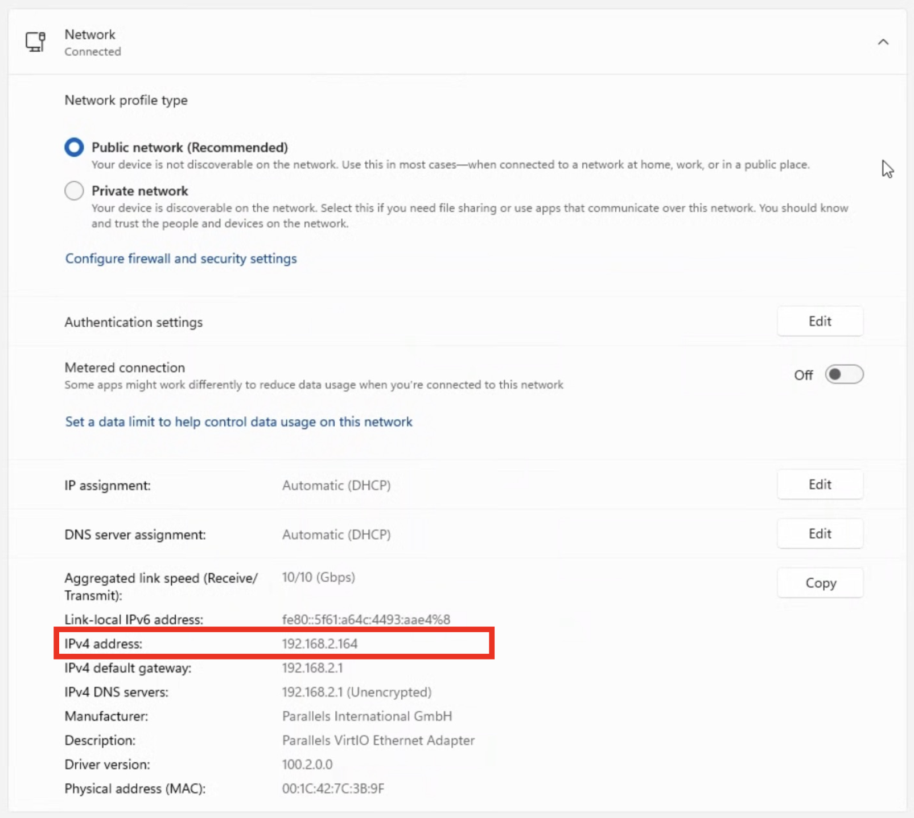

# SailWatchPro

<p align="center">
  <a href="https://sailwatchpro.io/">
    
  </a>
</p>

<p align="center">
  <strong>Setup Guide</strong>
</p>

---

## Table of Contents

- [Getting Started](#getting-started)
- [Step 1 — Configure Expedition Marine](#step-1--configure-expedition-marine)
- [Step 2 — Connect SailWatchPro](#step-2--connect-sailwatchpro)
- [Step 3 — Configure Your Boat](#step-3--configure-your-boat)
- [Step 4 — Choose Display Mode](#step-4--choose-display-mode)
- [Step 5 — Import Data Files](#step-5--import-data-files)
- [Expedition Marine Channel Requirements](#expedition-marine-channel-requirements)
- [Test Network Connectivity](#test-network-connectivity)
- [Safety Settings](#safety-settings)
- [Troubleshooting](#troubleshooting)
- [Support & Updates](#support--updates)

---

## Getting Started

**All iOS devices (iPhone & Watch) should run the same version of the app**, as data is shared between users.

**First launch** will take a few extra moments while the app performs a one-time installation of the ECMWF libraries.

**Open Settings:**
- iPad → Settings
- iPhone → More > Settings

---

### Step 1 — Find IP Addresses

**Expedition PC IP address:**
1. Open a Windows Command Prompt:
   - **Native Windows PC:** Press **Windows Key + R**, type `cmd`, press Enter
   - **Mac running Parallels or VMware:** Click the **Start menu** with your mouse, type `cmd`, press Enter
2. Type `ipconfig` and look for **IPv4 Address** under your active network adapter
3. Note this IP (example: `192.168.1.50`)


<div align="center">
  
  <br><em>Your Expedition PC IP address</em>
</div>
<br>

**Add a new Expedition network for SailWatchPro:**

1. Start Expedition Marine on the boat PC
2. From the ☰ Hamburger Menu → drag down → hover over **Instruments** → click **Number of network connections**
3. Enter one greater than the displayed number → click **OK**
4. Go back to **Instruments** → select the new network and configure:
   - **Alias:** SailWatchPro
   - **Instruments:** Expedition
   - **Address:** your Expedition PC's IP address
   - **Port:** any unused port number
5. Click **Expedition Settings**
6. In **Exp Rx filter:** check **Receive marks**
7. In **Exp Tx filter:** enable the channels listed in [Expedition Marine Channel Requirements](#expedition-marine-channel-requirements) below

---

## Step 2 — Connect SailWatchPro

1. Install SailWatchPro on your iOS device via TestFlight
2. Open **Settings** in the app
3. Enter the same **IP address** and **UDP port** you configured in Expedition Marine

<div align="center">
  
  <br><em>Enter your connection parameters</em>
</div>
<br>

4. If using an NMEA 2000 Ethernet Gateway, enter its IP address and port
5. Restart the connection and look for **green** status indicators

**Port configuration must be opposite between Expedition and SailWatchPro:**

| Application | Rx Port (Receive) | Tx Port (Transmit) |
|-------------|-------------------|-------------------|
| **Expedition Marine** | 5098 | 5099 |
| **SailWatchPro** | 5099 | 5098 |

Expedition's Tx port (5099) must match SailWatchPro's Rx port (5099), and vice versa.

**To verify in SailWatchPro:** Settings → Expedition Marine → confirm Rx and Tx ports

---

## Step 3 — Configure Your Boat

<div align="center">
  
  <br><em>Enter your boat parameters</em>
</div>
<br>

| Field | Purpose |
|-------|---------|
| **Boat Name** | Vessel identification |
| **MMSI** | AIS identification (if applicable) |
| **Boat Length** | Distance calculations in boat lengths |
| **Draft** | Critical for depth safety alerts |
| **TWA Reaching Threshold** | Sailing mode detection sensitivity |

Touch **[Done]** when finished.

---

## Step 4 — Choose Display Mode

| Mode | Description |
|------|-------------|
| **Light Mode** | Dark text on light background |
| **Dark Mode** | Light text on dark background |
| **Night Mode** | Red-tinted display for night vision preservation |
| **Test Mode** | Simulated data for training and demos |

Light Mode and Dark Mode are set via iOS **Settings > Display & Brightness > Appearance.**  
Night Mode is enabled and disabled within SailWatchPro Settings.

---

## Step 5 — Import Data Files

Download all import files from:

[All Import Files / GitHub Release →](https://github.com/jbistis/SailWatchPro-Public/releases/tag/importFilesBuild65)

[All Import Files / Google Drive →](https://drive.google.com/drive/folders/1XXa9frakEL_QT7oMJfO0aDO2mqGzbGHm?usp=drive_link)

### Buoy List

[](https://github.com/jbistis/SailWatchPro-Public/releases/download/ImportFilesBuild65/default_buoys.csv)

- File name **must** remain `default_buoys.csv`
- To add buoys, follow the format in the default file
- Importing a new file replaces the existing list

<div align="center">
  
  <br><em>Load your race buoy weather stations</em>
</div>
<br>

### Sail Crossover Charts and Polars

[](https://github.com/jbistis/SailWatchPro-Public/releases/download/ImportFilesBuild65/sail-chart-della-aurora-20251029.xml)

[](https://github.com/jbistis/SailWatchPro-Public/releases/download/ImportFilesBuild65/performance-sail-chart-della-aurora.txt)

[](https://github.com/jbistis/SailWatchPro-Public/releases/download/ImportFilesBuild65/ORC-polars-della-aurora-2dot5m-20251029.txt)

Use the import buttons in the app to load each file.

<div align="center">
  
  <br><em>Import Sail Crossover Charts and Polars</em>
</div>
<br>

| File | Format |
|------|--------|
| Sail Crossover Chart | `.txt` or `.xml` export from Expedition Marine |
| Sail Performance Crossover Chart | `.tsv` export from sailing analytics |
| Polars | `.txt` export from Expedition Marine |

### Competitors

[](https://github.com/jbistis/SailWatchPro-Public/releases/download/ImportFilesBuild65/competitors.csv)

- Use the import icon in the toolbar to load the competitors file
- Use the **[+ Add]** button to add a single competitor manually
- Touch the **3-dot circle** to the right of [+ Add] to enter race information (Yacht Scoring eID number, etc.)

<div align="center">
  
  <br><em>Load your competitors file</em>
</div>
<br>

<div align="center">
  
  <br><em>Enter race information</em>
</div>
<br>

---

## Expedition Marine Channel Requirements

### Exp Rx Filter
Enable **Receive marks**

### Exp Tx Filter

| | | |
|:-|:-:|:-:|
| AWS | AWA | Barometer |
| BSP | Cog | Course |
| Current drift | Current drift predicted | Current set |
| Current set predicted | Depth | Heading - Cog |
| Heading to steer | Heading to steer polar | Heel (roll) |
| J1 | Latitude | Layline bearing |
| Layline bearing on port | Layline bearing on strb | Layline dist on port |
| Layline dist on starb | Layline distance | Layline time |
| Layline time on port | Layline time on starb | Longitude |
| Magnetic variation | Mark bearing | Mark bearing - Cog |
| Mark latitude | Mark longitude | Mark range |
| Mark time | Mark twa | Next mark awa |
| Next mark aws | Next mark bearing | Next mark latitude |
| Next mark longitude | Next mark polar time | Next mark range |
| Next mark time on port | Next mark time on starb | Next mark twa |
| Opposite track | Polar bsp | Polar bsp % |
| Predicted twd | Predicted tws | Predicted Drift |
| Sail | Sail event | Sail mark |
| Sail next mark | Sea temperature | Sog |
| Start bias angle | Start bias length | Start distance below line |
| Start layline on port | Start layline on strdb | Start line square wind |
| Start port latitude | Start port longitude | Start stdb latitude |
| Start stdb longitude | Start time to burn | Start time to gun |
| Start time to layline P | Start time to layline S | Start time to line |
| Start time to port | Start time to port burn | Start time to strb |
| Start time to strb burn | Target bsp | Target bsp % |
| Target twa | Trim (pitch) | TWA |
| TWD | TWD predicted | TWS |
| TWS predicted | VMC | VMC % |
| VMC optimum | VMG | VMG % |

---

## Test Network Connectivity

Use these steps if you're having trouble establishing a connection.

### Step 1 — Find IP Addresses

**Expedition PC (Windows):**
1. Press **Windows Key + R**, type `cmd`, press Enter
2. Type `ipconfig`
3. Note the **IPv4 Address** under your active adapter (example: `192.168.1.50`)

**iPad/iPhone:**
- Settings → Wi-Fi → tap **(i)** icon → IPv4 Address (example: `192.168.1.100`)

---

### Step 2 — Ping from iPad to PC

1. Install [Ping - Network Utility](https://apps.apple.com/us/app/ping-network-utility/id576773404) on your iPad
2. Ping your Expedition PC's IP address
3. Successful replies confirm basic connectivity

---

### Step 3 — Ping from PC to iPad

1. Open Command Prompt on your Expedition PC
2. Type: `ping 192.168.1.100` (use your iPad's actual IP)
3. Successful replies confirm two-way connectivity

**If ping works both ways, your network is fine.** The issue is likely firewall or port configuration — see below.

---

### Check Windows Firewall

**Quick test — temporarily disable firewall** (open Command Prompt as Administrator):

```cmd
netsh advfirewall set allprofiles state off
```

Test your connection. If it works, the firewall was blocking UDP traffic.

**Re-enable firewall:**
```cmd
netsh advfirewall set allprofiles state on
```

**Permanent fix — add firewall rules:**

1. **Windows Defender Firewall** → Advanced Settings → Inbound Rules
2. **New Rule** → Port → UDP
3. **Specific local ports:** `5098, 5099`
4. **Allow the connection** → Apply to all profiles
5. Name: `Expedition Marine UDP Ports`

Also add an application rule:
1. **New Rule** → Program
2. Browse to `Expedition.exe`
3. **Allow the connection** → Apply to all profiles

---

### Still Having Issues?

- ✅ Both devices on the same Wi-Fi network
- ✅ No VPN active on either device
- ✅ Router not blocking UDP broadcasts — disable **AP Isolation** if present
- ✅ Expedition UDP output enabled and broadcast IP set to `255.255.255.255`

---

## Safety Settings

| Setting | Description |
|---------|-------------|
| **Depth Alerts** | Automatic warnings based on draft + safety margin |
| **Audio Countdown** | Spoken start sequence announcements |
| **MOB (Man Overboard)** | Emergency position marking and tracking |

> Safety depth alerts only activate when **Draft** is set to a value greater than 0 in Boat Configuration.

---

## Troubleshooting

### Connection Issues
- **Red status indicators** → Verify IP address and UDP port
- **No data** → Confirm Expedition Marine is broadcasting
- **Intermittent** → Check WiFi signal strength and network stability

### Display Problems
- **Data not updating** → Restart the UDP connection in settings or restart Expedition Marine
- **Watch not syncing** → Check iPhone–Watch connectivity and app permissions

### Performance Issues
- **Slow response** → Shorten chart time windows or restart the app
- **Battery drain** → Use Night Mode and reduce display brightness
- **Memory** → Clear old event logs and restart periodically

---

## Support & Updates

SailWatchPro is actively developed with new features based on user feedback and racing experience. Keep both iPhone and Watch apps on the same version for best results.

**Support & Feature Requests:**
https://github.com/jbistis/SailWatchPro-Public/issues

Happy sailing! ⛵  
**SailWatchPro Team**
