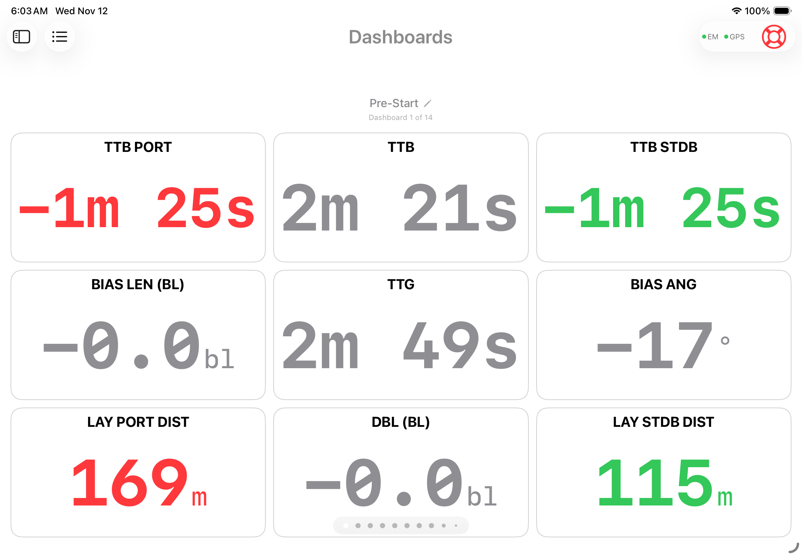
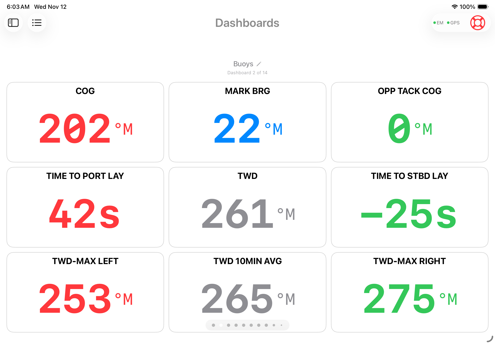
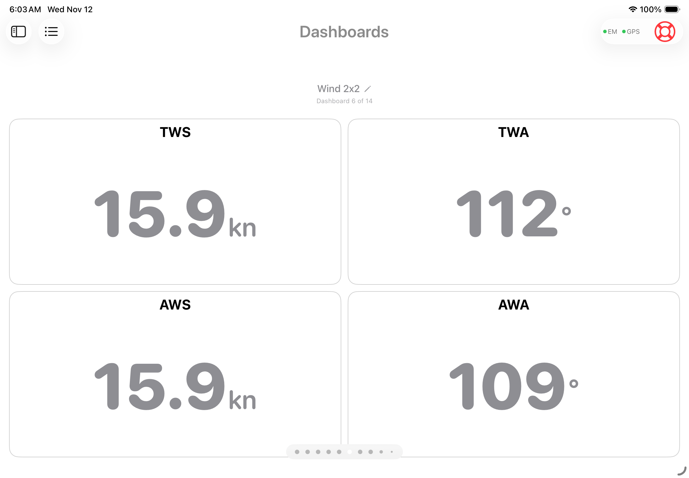
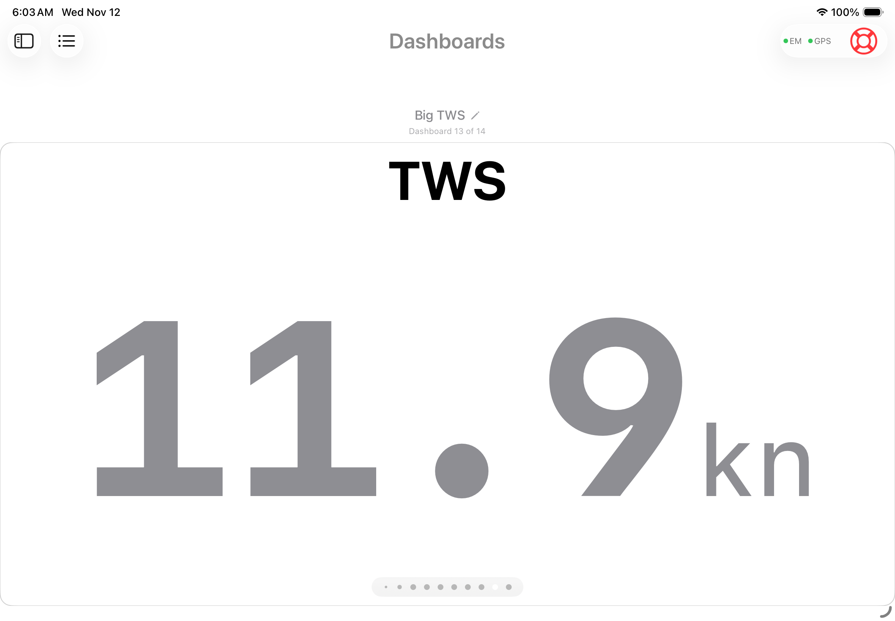
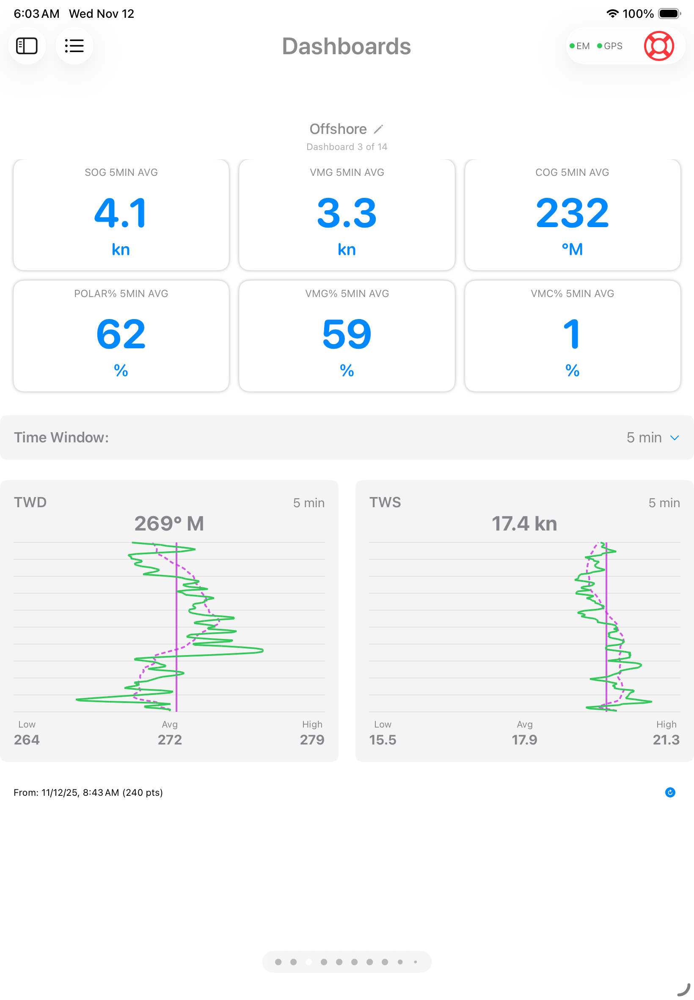
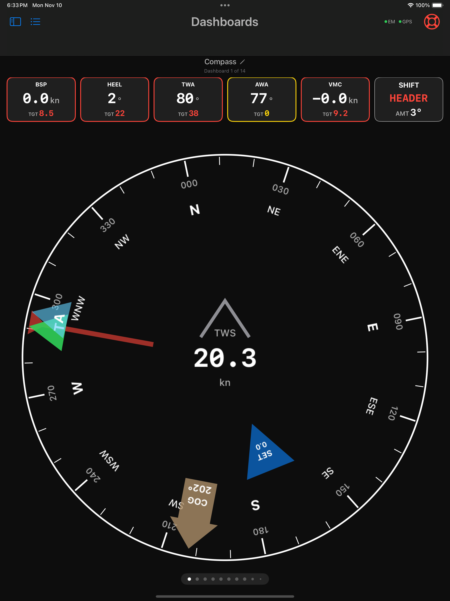
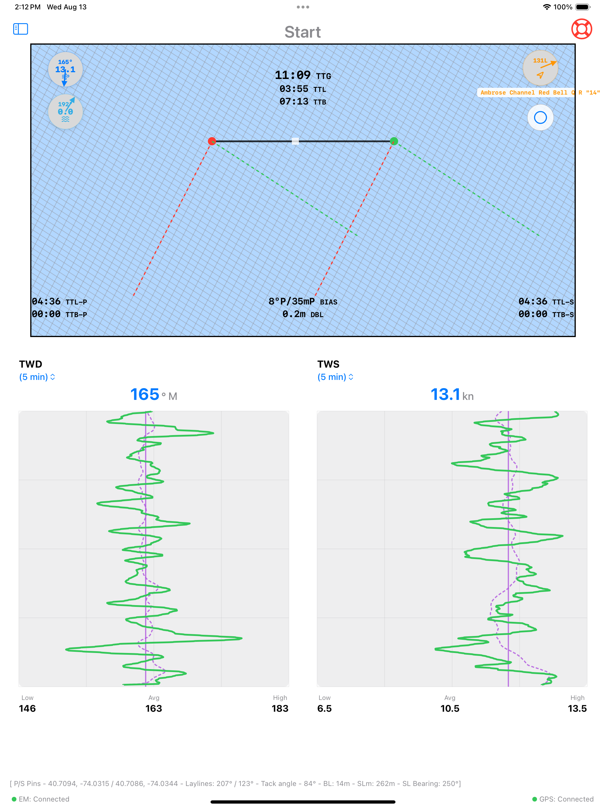
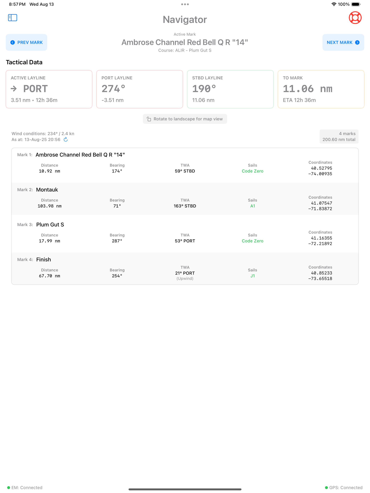
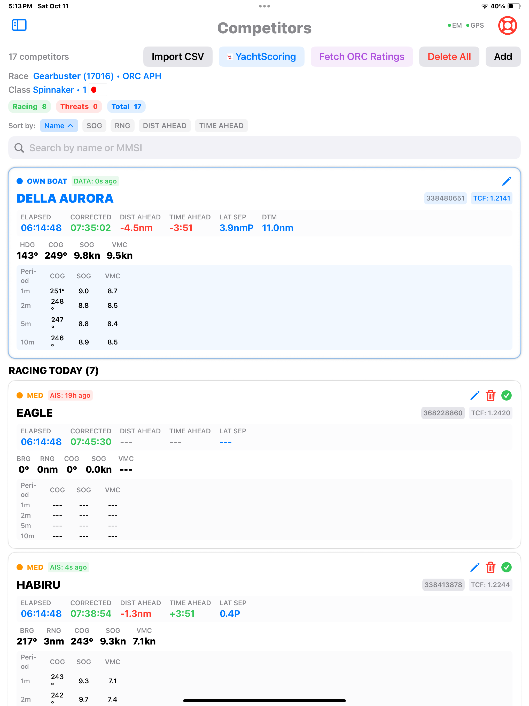
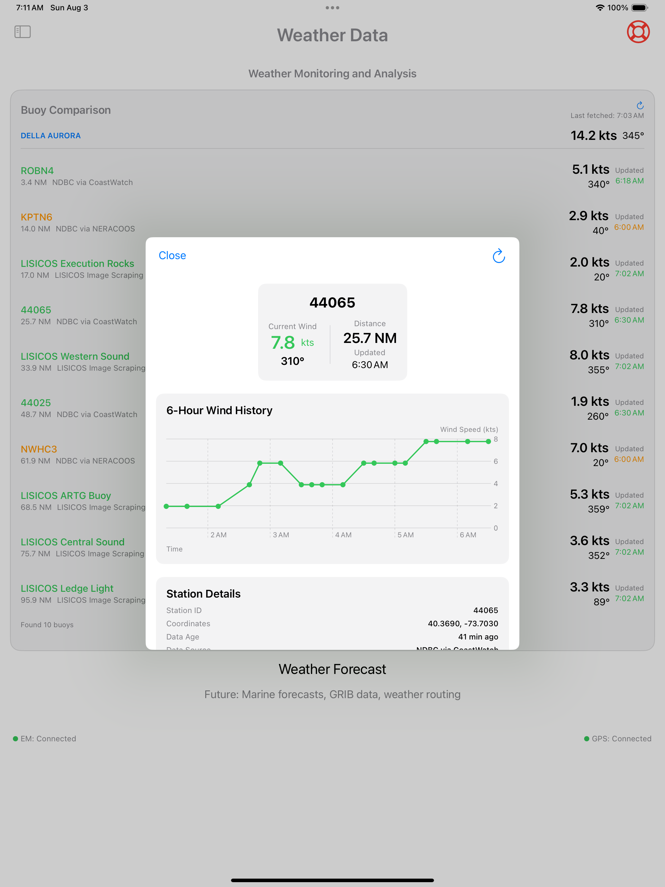

# SailWatchPro

  

  <strong>User Manual</strong>

---

## Table of Contents

- [Introduction](#introduction)
- [Dashboards](#dashboards)
- [Pre-Start](#pre-start)
- [Start](#start)
- [Navigator — Course Management](#navigator--course-management)
- [Competitor Tracking](#competitor-tracking)
- [Advisories](#advisories)
- [Wind Analytics](#wind-analytics)
- [Weather Data](#weather-data)
- [MOB Function](#mob-function)
- [Apple Watch Integration](#apple-watch-integration)
- [Settings Reference](#settings-reference)
- [System Requirements](#system-requirements)
- [Support & Updates](#support--updates)

---

## Introduction

SailWatchPro extends Expedition Marine above-deck with a sleek, touch-friendly interface for iPad, iPad Mini, iPhone, and Apple Watch. Built for competitive sailing, it delivers real-time tactical insights by translating critical data — wind patterns, boat speed, course positioning — into clear, actionable information. Whether racing around the buoys or navigating offshore, SailWatchPro helps your team make fast, confident decisions when every second counts.

> For connection and initial configuration, see the [Setup Guide](SETUP-GUIDE.md).

---

## Dashboards

SailWatchPro provides **12 user-definable dashboards**, each fully customizable with any Expedition Marine channel or computed metric.

  
  
  
  
  
  

 

**Computed channels available for any dashboard field:**

| Channel | Averages Available |
|---------|-------------------|
| COG, SOG, VMG, VMG%, VMC, VMC% | 5, 10, and 15-minute rolling averages |
| Polar%, Target Boat% | 5, 10, and 15-minute rolling averages |

Many fields also support **context-aware switching** based on sailing mode (upwind / reaching / downwind) and provide **color feedback** for out-of-bounds conditions.

Dashboards can be renamed and reordered:

  
   <em>Build custom names in custom order</em>

 

**Example layouts:**

  
   <em>Pre-Start Dashboard</em>

 

  
   <em>Buoy Racing Dashboard</em>

 

  
   <em>Offshore Racing Dashboard</em>

 

  
   <em>Driver Performance Dashboard</em>

 

---

## Pre-Start

The Pre-Start view is where you ping the pins, select a race course, and set and synchronize the race timer.

  
   <em>Pre-Start Dashboard</em>

 

### Race Timers

| Timer | Description |
|-------|-------------|
| **To Gun** | Time until race start |
| **To Burn** | Time until you should begin your approach |
| **To Line** | Time until you should cross the starting line |
| **Elapsed** | Race time after the gun |

### Timer Controls

- Set countdown timers: 15, 10, 5, or 3 minutes
- **SYNC** — Round timer to nearest whole minute
- **KILL** — Stop active countdown
- **+1 / -1** — Adjust timer by one second

### Start Line Setup

- **Set Port / Starboard Pins** — Double-tap to ping start line ends to Expedition
- **Line Bias Analysis** — Real-time bias angle and length in boat lengths
- **Distance Below Line** — Safety indicator showing your position relative to the line

### Course Selection

Load race courses from Expedition Marine.

---

## Start

The Start view displays the Start Area showing your boat's position relative to the start line and pin laylines. It presents TTG, TTB, TTL, and DTL data for port, center, and starboard positions, a graphical representation of line bias, and the heading to the first mark — helping you identify the optimal place to cross the line.

  
   <em>Start Line View</em>

 

- Start Area Grid
- Wind Strip Charts

---

## Navigator — Course Management

  
   <em>Course Map View</em>

 

- **Electronic Map Display** — Real-time position with course overlay and buoy wind data
- **Waypoint Management** — Mark positions and distances with True Wind Angles

  
   <em>Course Table View with Mark Bearings and Estimated Wind Angles</em>

 

  
   <em>Course Map with Buoy/GRIB data and Competitor Heat Map</em>

 

---

## Competitor Tracking

  
   <em>Competitor Tracking with Live Leaderboard</em>

 

### Header

- Total competitor count with breakdown by category
- Current race information: name, ID, scoring system, class, and flags
- Action buttons for importing data, adding competitors, and managing the database

### Status Chips

| Chip | Color | Meaning |
|------|-------|---------|
| Racing | Green | Competitors currently marked as racing |
| Threats | Red | Competitors classified as threats by proximity and position |
| Total | Blue | Complete competitor count |

### Sorting and Search

- Filter competitors by name or MMSI
- Sort by name, distance, threat level, and more (ascending or descending)

### Competitor Sections

**Our Boat** — When your boat is in the competitor database and marked as racing, displays own-boat card with elapsed time, corrected time (TCF), and tactical position.

**Racing Competitors** — Enhanced cards showing:
- Real-time position: bearing, range, course, speed
- Threat level indicators (color-coded circles)
- AIS data freshness
- Race timing: elapsed and corrected times
- Rolling averages for COG, SOG, and VMC over 1, 2, 5, and 10-minute periods
- Tactical analysis: distance ahead/behind and lateral separation

**All Competitors** — Non-racing competitors listed with basic info; can be toggled to racing status, edited, or deleted.

**Detected Vessels** — AIS-detected vessels that can be added as competitors (Class A and Class B filtering, one-click addition).

### Tactical Calculations

**Distance Ahead** measures positional advantage along the race course:
- Positive: you are closer to the active mark than the competitor
- Negative: competitor is closer to the mark
- Displayed in nautical miles (e.g., `+0.3 nm`, `-1.2 nm`)
- Requires both boats to be racing, have valid GPS, be on the same leg, and have an active mark

**Same-Leg Detection** uses VMC analysis: both boats must have positive VMC toward the active mark, with VMC difference within a reasonable tactical variation.

---

## Advisories

Centralized, automated alerts that monitor conditions on your behalf — so you can focus on steering and tactics.

  
   <em>Advisory Panel</em>

 

Advisories are checked every 5 minutes. Each advisory replaces its previous instance (no stacking of the same type). When a condition resolves, the advisory is automatically cleared. The most critical active advisory syncs to Apple Watch.

For full advisory trigger conditions, thresholds, and messages, see the [Advisory Reference](ADVISORY-REFERENCE.md).

**Advisory categories:**

| Category | Examples |
|----------|---------|
| Weather | Barometric pressure drops, GRIB accuracy bias |
| Sail | Sail change recommended, approaching crossover |
| Safety | Shallow water, depth sensor failure, excessive heel |
| Tactical | Sail mismatch, overstood layline |
| Navigation | — |
| Performance | Below polar target, current/leeway push |

  
   <em>Current push advisory with opposite tack VMG prediction</em>

 

---

## Wind Analytics

Your boat is a moving weather station. SailWatchPro analyzes real-time wind trends using rolling averages, FFT, and wavelet transforms to identify veering/backing, building, and oscillating patterns — with confidence indicators and a 6-hour wind history that syncs across devices.

  
   <em>Wind trend analysis from boat instruments</em>

 

**Nearby buoy polling** automatically fetches data from NOAA/NDBC stations within a user-defined distance. Overlay predicted GRIB with actual observations and track divergences in real time.

  
   <em>Automated recurring buoy data fetching</em>

 

  
   <em>Buoy: Predicted vs. Actual Wind Trends</em>

 

  
   <em>Boat: Predicted vs. Actual Wind Trends</em>

 

---

## Weather Data

- Real-time atmospheric pressure monitoring with trend analysis
- Historical weather pattern analysis
- Integration with nearby buoy data
- GRIB forecast overlay with actual observations

  

 

---

## Sail and Crew Event Logging

### Sail Changes

Log sail changes with one tap. SailWatchPro instantly sends events to Expedition Marine and keeps your entire crew in sync across iPads, iPhones, and Macs.

  
   <em>Sail change logging, synced to Expedition Marine</em>

 

### Crew Position Changes

Define custom crew positions and assign them only to qualified crew members. Log crew changes with one tap — events are sent to Expedition Marine and synced across all devices.

  
   <em>Custom position titles with eligibility enforcement</em>

 

---

## MOB Function

In a Man Overboard situation, SailWatchPro communicates the incident to Expedition Marine and your chartplotters. The MOB view continuously calculates the estimated MOB position and hypothermia risk to help prepare the crew for recovery.

  

 

---

## Apple Watch Integration

  
   <em>Apple Watch racing views</em>

 

**Dedicated watch views:**

| View | Description |
|------|-------------|
| Race Timer | Dedicated start sequence display |
| BSP Split Box | Speed data with performance indicators |
| Heel Angle | Real-time heel monitoring |
| VMG Split Box | Velocity made good analysis |
| TWA / AWA Split Boxes | Wind angle optimization |
| Depth Split Box | Safety monitoring with automatic page switching on dangerous conditions |
| Custom Data Fields | Any user-defined dashboard field |

Watch data syncs seamlessly from the iPhone app, with Night Mode support on all watch faces. The most critical active advisory is automatically pushed to the watch.

---

## Settings Reference

| Setting | Description |
|---------|-------------|
| **IP Address** | Expedition Marine network address |
| **UDP Port** | Communication port (typically 5098) |
| **Test Mode** | Simulated data for training and demos |
| **Boat Name** | Vessel identification |
| **Boat Length** | For distance calculations in boat lengths |
| **Draft** | Critical for depth safety calculations |
| **TWA Reaching Threshold** | Sailing mode detection sensitivity |
| **Night Mode** | Display appearance |
| **Map Style** | Hybrid, standard, satellite, or imagery |
| **Chart Time Windows** | Customizable data history viewing |
| **Depth Alerts** | Warnings based on draft + safety margin |
| **Audio Countdown** | Spoken start sequence announcements |
| **MOB** | Emergency position marking and tracking |

> For initial connection and boat configuration steps, see the [Setup Guide](SETUP-GUIDE.md).

---

## System Requirements

| Platform | Minimum Version |
|----------|----------------|
| iPad / iPhone | iOS 18.5 |
| Apple Watch | watchOS 11.5 |
| Mac (Apple silicon) | macOS 15.6 |
| Expedition Marine | 12.6.9 (latest encouraged) |

Also required: reliable boat WiFi. NMEA 2000 Ethernet Gateway required for competitor tracking via AIS.

---

## Support & Updates

SailWatchPro is continuously updated with new features and improvements based on user feedback and racing experience. Keep both iPhone and Watch apps on the same version for best results.

**Support & Feature Requests:**
https://github.com/jbistis/SailWatchPro-Public/issues

*Happy sailing, and may you always find the favorable wind shift!*  
**SailWatchPro Team**
