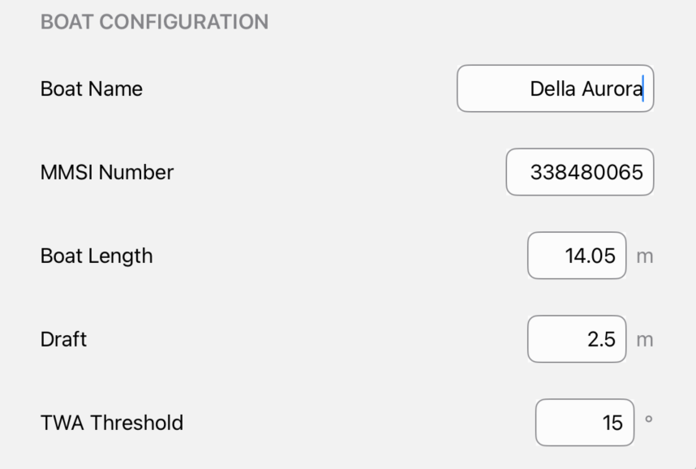

# SailWatchPro

  

  Setup Guide

---

## Table of Contents

- [Getting Started](#getting-started)
- [First Launch Setup](#first-launch-setup)

- [Expedition Marine Requirements](#expedition-marine-requirements)
- [Connection Settings](#connection-settings)
- [Boat Configuration](#boat-configuration)
- [Display Options](#display-options)
- [Safety Settings](#safety-settings)
- [Data Imports](#data-imports)
- [Troubleshooting](#troubleshooting)
- [Connection Issues](#connection-issues)
- [Display Problems](#display-problems)
- [Performance Issues](#performance-issues)
- [Support & Updates](#support--updates)

---

## Getting Started

**Latest Version**  
It is strongly recommended that all iOS devices (iPhone & Watch) run the latest version of the app, as some data is shared between users.

### First Launch
The first launch will take a few moments as the app has install the ECMWF libraries.  This is just on the first launch.  

**Start Expedition Marine Network**  
   - Download the App
   - Start the App on your iPhone or iPad
   - On the iPad, navigate to Settings and enter the following:

**Connection Information**  

  
   <em>Enter your boat parameters</em>

 

**Boat Configuration**  

  
   <em>Enter your boat parameters</em>

 

Touch Done

**Load Buoys for Weather Data Stations**  
Navigate to Weather Data and press the + sign in the top toolbar

  
   <em>Enter your boat parameters</em>

 

**Load sail crossover charts and polars**

  
   <em>Enter your boat parameters</em>

 

**Load buoys**  

**Load buoys**  
Navigate to Competitors to load competitors

---

## Connection Settings

- **IP Address**: Boat network broadcast address  
- **UDP Port**: Usually 5098  
- **Test Mode**: Enable for simulated training data  

## Boat Configuration

- **Boat Name** — Vessel identification  
- **Boat Length** — For distance calculations in boat lengths  
- **Draft** — Critical for depth safety  
- **TWA Reaching Threshold** — Adjusts sailing mode detection  

## Display Options

- Light Mode  
- Dark Mode  
- Night Mode (red-tinted)  
- Chart Time Windows (custom history view)  
- Map Style (hybrid, standard, satellite, imagery)  

## Safety Settings

- **Depth Alerts** — Draft + safety margin warnings  
- **Audio Countdown** — Spoken start sequence  
- **MOB (Man Overboard)** — Emergency position mark & tracking  

## Data imports

You can find sample import files at https://github.com/jbistis/SailWatchPro-Public/tree/main/documents 

- **Buoys** — file name must be `default_buoys.csv`
- **Sail Crossover Chart** — Txt or xml export from Expedition Marine
- **Sail Performance Crossover Chart** — export tsv from sailing analytics
- **Polars** — Txt or export from Expedition Marine
- **Competitors** — Bulk high speed entry

## Troubleshooting

### Connection Issues
- Red indicators → Verify IP & port  
- No data → Confirm Expedition is broadcasting  
- Intermittent → Check WiFi strength/stability  

### Display Problems
- Data not updating → Restart connection or Expedition  
- Watch not syncing → Check iPhone–Watch link & permissions  

### Performance Issues
- Slow → Shorten chart time windows / restart app  
- Battery drain → Use Night Mode + lower brightness  
- Memory → Clear old logs / restart periodically  

---

## Support & Updates

SailWatchPro is actively developed with new features based on user feedback and racing experience.  

For best results, keep both iPhone and Watch apps on the same version.  

**Support & Feature Requests**:  
https://github.com/jbistis/SailWatchPro-Public/issues

Happy sailing! ⛵
**SailWatchPro Team**

