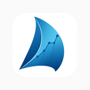
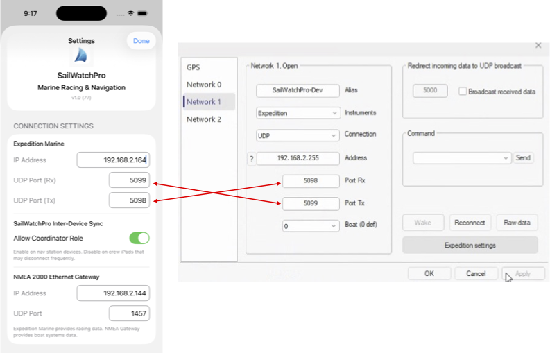
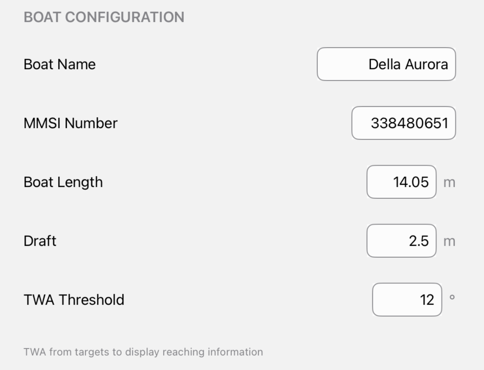
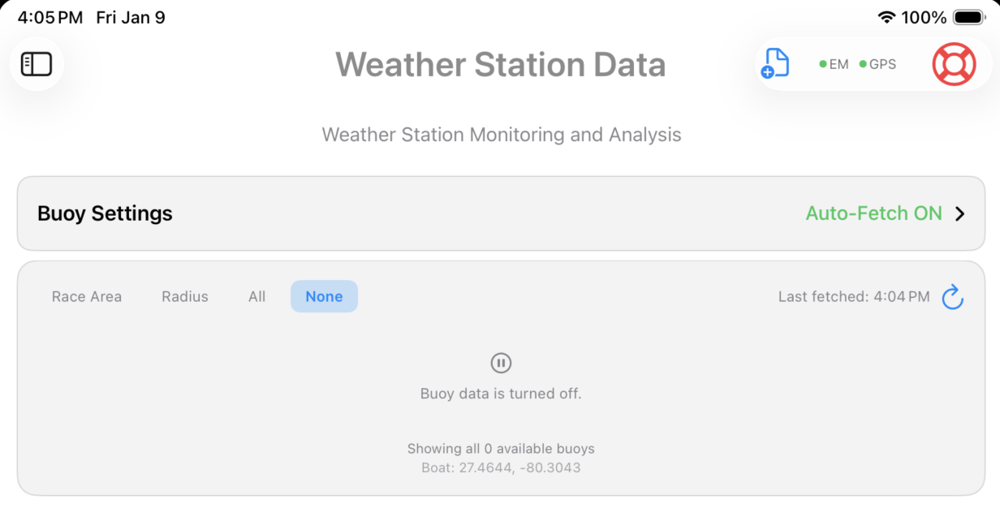
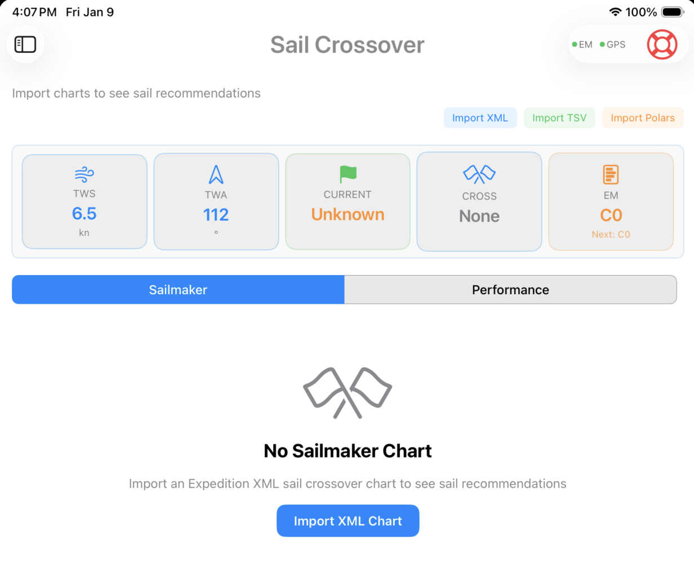
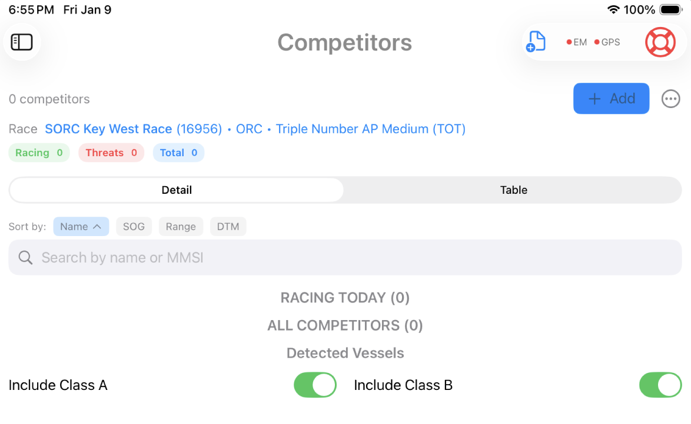
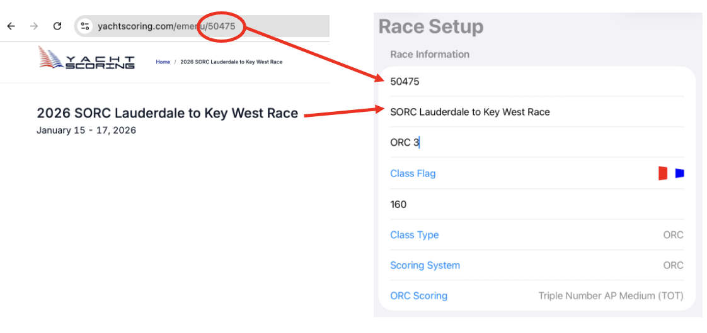

# SailWatchPro

<p align="center">
  <a href="https://sailwatchpro.io/">
    
  </a>
</p>

<p align="center">
  <strong>End-User Device Setup Guide</strong>
</p>

---

## Table of Contents

- [Getting Started](#getting-started)
- [First Launch Setup](#first-launch-setup)
- [Expedition Marine Requirements](#expedition-marine-requirements)
- [Connection Settings](#connection-settings)
- [Boat Configuration](#boat-configuration)
- [Display Options](#display-options)
- [Safety Settings](#safety-settings)
 [Performance Issues](#performance-issues)
- [Support & Updates](#support--updates)

---

## Getting Started

**Latest Version**  
It is strongly recommended that all iOS devices (iPhone & Watch) run the latest version of the app, as some data is shared between users.

### First Launch
The first launch will take a few additional moments while the app performs a one-time installation of the ECMWF libraries.

### Settings
- Download the App
- Start the App on your iPhone or iPad
- iPad - navigate to Settings
- iPhone - navigate to More > Settings

**Connection Information**
Enter values specific to your boat as supplied by your Expedition Marine Administrator
<div align="center">
  
  <br><em>Enter your connection parameters</em>
</div>
<br>

## Troubleshooting Connection Issues

### Test Network Connectivity

**From your iPad/iPhone:**
1. Install a ping utility app: [Ping - Network Utility](https://apps.apple.com/us/app/ping-network-utility/id576773404)
2. Find your Expedition PC's IP address:
   - On Windows: Press **Windows Key + R**, type `cmd`, press Enter
   - Type `ipconfig` and look for **IPv4 Address** under your active network adapter
3. Ping that IP address from your iPad using the ping utility app

**From your Expedition PC:**

**Open Command Prompt:**
1. Press **Windows Key + R** (or click Start menu)
2. Type `cmd` and press Enter
3. A black window will open - this is the Command Prompt

**Find your iPad's IP address:**
- Settings → Wi-Fi → Tap the (i) icon → IPv4 Address

**Ping your iPad/iPhone:**
1. Type: `ping` followed by your iPad's IP address
   - Example: `ping 192.168.1.100`
2. Press Enter

**If ping works in both directions, your network is fine.** The issue is likely firewall or port configuration.

---

### Verify Port Settings

Port configuration must be **opposite** between Expedition and SailWatchPro:

| Application | Rx Port (Receive) | Tx Port (Transmit) |
|-------------|-------------------|-------------------|
| **Expedition Marine** | 5098 | 5099 |
| **SailWatchPro** | 5099 | 5098 |

**Why opposite?** Expedition's Tx port (5099) must match SailWatchPro's Rx port (5099), and vice versa.

**To check in SailWatchPro:**
- Settings → Expedition Marine → Verify Rx and Tx ports

---

### Check Windows Firewall

**Quick Test: Temporarily disable firewall**

Open Command Prompt **as Administrator** and run:
```cmd
netsh advfirewall set allprofiles state off
```

Test your connection. If it works, the firewall was blocking UDP traffic.

**Re-enable firewall:**
```cmd
netsh advfirewall set allprofiles state on
```

---

**Permanent Fix: Add firewall rules for Expedition**

1. **Windows Defender Firewall** → Advanced Settings → Inbound Rules
2. **New Rule** → Port → UDP
3. **Specific local ports:** `5098, 5099`
4. **Allow the connection** → Apply to all profiles
5. Name: "Expedition Marine UDP Ports"

**Also add an application rule:**
1. **New Rule** → Program
2. Browse to `Expedition.exe`
3. **Allow the connection** → Apply to all profiles

---

### Still Having Issues?

**Check these:**
- ✅ Both devices on the same Wi-Fi network
- ✅ No VPN active on either device
- ✅ Router not blocking UDP broadcasts (some routers have "AP Isolation" - disable it)
- ✅ Expedition UDP output is enabled and set to broadcast IP: `255.255.255.255`

**Boat Configuration**  
- **Boat Name** — Vessel identification  
- **Boat Length** — For distance calculations in boat lengths  
- **Draft** — Critical for depth safety  
- **TWA Reaching Threshold**
<div align="center">
  
  <br><em>Enter your boat parameters</em>
</div>
<br>

Touch the [Done] button

---

## Buoy List Import
### Download buoys list

[](https://github.com/jbistis/SailWatchPro-Public/releases/download/ImportFilesBuild65/default_buoys.csv)

### Import buoys list
The file name must remain default_buoys.csv.  To add more buoys, follow the format used in the default file.  When you import a buoy file, the new file replaces the existing list.

<div align="center">
  
  <br><em>Load your race buoy weather stations</em>
</div>
<br>

---

## Import Sail Crossover Charts and Polars
### Download Source Datafiles
[](https://github.com/jbistis/SailWatchPro-Public/releases/download/ImportFilesBuild65/ORC-polars-della-aurora-2dot5m-20251029.txt)

[](https://github.com/jbistis/SailWatchPro-Public/releases/download/ImportFilesBuild65/ORC-polars-della-aurora-2dot5m-20251029.txt)

[](https://github.com/jbistis/SailWatchPro-Public/releases/download/ImportFilesBuild65/ORC-polars-della-aurora-2dot5m-20251029.txt)

### Import the Source Datafiles using the import buttons

<div align="center">
  
  <br><em>Enter your Sail Crossover Charts and Polars</em>
</div>
<br>

---

## Import Competitors
### Download Source Datafile
[](https://github.com/jbistis/SailWatchPro-Public/releases/download/ImportFilesBuild65/competitors.csv)

### Load the Competitor Datafile using the import icon in the toolbar.  Use the [+ Add] button to add one competitor.
<div align="center">
  
  <br><em>Load your competitors file</em>
</div>
<br>

### Enter the Race Information (Yacht Scoring eID number, if available).

Touch the 3-dot circle just to the right of [+ Add] button to enter and update the race information.
<div align="center">
  
  <br><em>Load your Race Information</em>
</div>
<br>

---

## File Downloads

- **Buoys** — file name must be `default_buoys.csv`
- **Sail Crossover Chart** — Txt or xml export from Expedition Marine
- **Sail Performance Crossover Chart** — export tsv from sailing analytics
- **Polars** — Txt or export from Expedition Marine
- **Competitors** — Bulk high speed entry

Visit the full release page:  

[All Import Files /Github Release →](https://github.com/jbistis/SailWatchPro-Public/releases/tag/importFilesBuild65)

[All Import Files /Goolge Drive →](https://drive.google.com/drive/folders/1XXa9frakEL_QT7oMJfO0aDO2mqGzbGHm?usp=drive_link)


## Display Options
- Light Mode and Dark Mode are set using your iOS device Settings > Display & Brightness > APPEARANCE
- Night Mode (red-tinted) is enabled and disabled in Settings
- Map Style (hybrid, standard, satellite, imagery)  

## Safety Settings
- **Depth Alerts** — Draft + safety margin warnings  
- **Audio Countdown** — Spoken start sequence  
- **MOB (Man Overboard)** — Emergency position mark & tracking

---

## Troubleshooting

### Connection Issues
- Red indicators → Verify IP & port  
- No data → Confirm Expedition is broadcasting  
- Intermittent → Check WiFi strength/stability  

### Display Problems
- Data not updating → Restart connection or Expedition  
- Watch not syncing → Check iPhone–Watch link & permissions  

### Performance Issues
- Slow → Shorten chart time windows/restart app  
- Battery drain → Use Night Mode + lower brightness  

---

## Support & Updates

SailWatchPro is actively developed, with new features driven by user feedback and racing experience.  

For best results, keep both iPhone and Watch apps on the same version.  

**Support & Feature Requests**:  
https://github.com/jbistis/SailWatchPro-Public/issues

Happy sailing! ⛵
**SailWatchPro Team**

