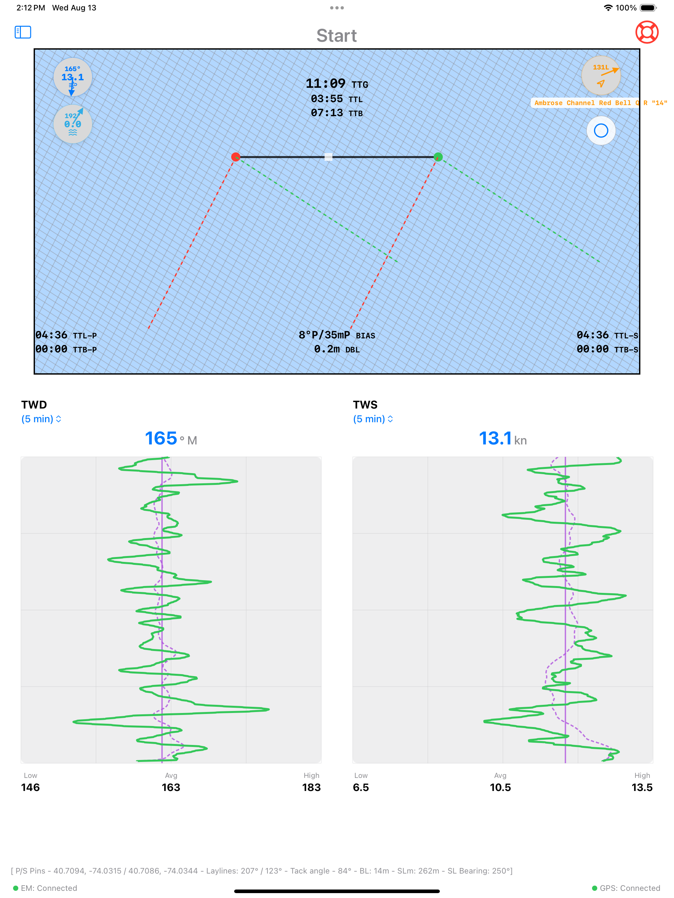

# SailWatchPro

  

 <strong>Win More Races. Make Faster Decisions.</strong>

  

---

## What It Does

SailWatchPro brings Expedition Marine data above deck with a touch-friendly interface for iPad, iPhone, and Apple Watch. Instead of going below to check the nav station, you get real-time tactical data in the cockpit—wind trends, competitor positions, performance metrics, and start line analysis.

---

## Key Features

 
 
 
 

### 📊 **Customizable Dashboards**
12 different layouts that display any Expedition Marine channel. Configure them for different race scenarios—pre-start, upwind work, reaching, or offshore. Fields show context-aware data based on sailing mode and provide visual alerts for out-of-range conditions.

### 🎯 **Start Line Tools**

 

Ping start line pins with a double-tap. The app calculates line bias, distance below line, and displays laylines with timing data for port, center, and starboard positions. Set countdown timers and sync them to the race sequence.

### 🌬️ **Wind Analysis**

 

Real-time wind trend analysis using rolling averages, FFT, and wavelet transforms. The app identifies patterns like veering, backing, building, or oscillating conditions and displays them with confidence indicators. Maintains a 6-hour wind history that automatically syncs across all crew devices on your boat's network.

### 🗺️ **Competitor Tracking**

  

Track competitor positions with calculated metrics including distance ahead/behind, corrected time deltas, and lateral separation. Import competitor data from YachtScoring or CSV files, with automatic ORC rating retrieval. The system identifies threats based on proximity and tactical position.

### 🗺️ **Navigation & Course Management**

  

Electronic charts display your position, race course overlay, and nearby buoy wind data. Mark waypoints with TWA information to plan routing based on forecasted conditions along your course.

### ⌚ **Apple Watch Integration**

 

Dedicated watch views for race timer, speed, heel angle, VMG, wind angles, and depth. Data syncs from your iPhone and the watch automatically switches to depth monitoring when approaching shallow water.

---

## Additional Capabilities

**Sail Management** – Import designer or performance-based crossover charts. Track sail inventory and log sail change events with time and location data for upload to Sailnjord.

**Weather Data** – Retrieve wind and weather information from NOAA, NDBC, NERACOOS, and LISICOS buoys within 100nm. Data syncs across all devices on your boat's network.

**Barometric Monitoring** – Track atmospheric pressure trends with visual history. The app alerts when pressure data stops updating.

**MOB Function** – Triggers alerts to Expedition and chartplotters, calculates estimated drift position, and provides hypothermia risk assessment.

---

## Technical Overview

SailWatchPro is designed for competitive sailing with features that address common racing scenarios:

- **12 Customizable Dashboards** with any Expedition Marine channel
- **Wind Trend Analysis** using FFT and wavelet transforms
- **Competitor Tracking** with distance and corrected time calculations
- **Start Line Analysis** with pin pinging and bias computation
- **Performance Metrics** with 5/10/15-minute rolling averages
- **Apple Watch Support** with automatic mode switching
- **Display Modes** including night mode with red-tinted display
- **Two-Way Expedition Integration** for marks, courses, and waypoints

---

## Requirements

- iOS 18.5+ (iPad/iPhone) | watchOS 11.5+ (Apple Watch)
- Expedition Marine 12.4.12+
- Reliable boat WiFi network

---

## Getting Started

1. **Connect** – Configure your Expedition Marine network settings
2. **Setup** – Enter boat parameters (length, draft, MMSI)
3. **Customize** – Select dashboard layouts for your racing style
4. **Use** – Access real-time data during races

[Full setup guide available here](https://docs.google.com/document/d/1cXRDmIqwttnDQbBGQB0azVdZFzVpno5fVTCnSREfSbo/edit?usp=sharing)

---

## Feedback & Support

SailWatchPro is actively developed based on user feedback from competitive sailing environments.

**[Report Issues & Request Features →](https://github.com/jbistis/SailWatchPro-Public/issues)**

---

*May you always find the favorable shift.*

**– The SailWatchPro Team**
